# ROS学习笔记

参考资料：

B站赵虚左：https://www.bilibili.com/video/BV1Ci4y1L7ZZ?p=19&vd_source=a8e8676617fb04db42af59b530b145fd

所用环境：linux20.04+ROS1 noetic

demo案例：使用python实现ROS版本的hello world

（ROS工作空间及功能包创建流程）

# 一、ROS创建工作空间及功能包流程总结整理（python）

## 1、创建工作空间：

选取自己计算机的某个位置，新建一个文件夹作为自己的工作空间

```
mkdir -p demo_ws/src
```

这里的demo_ws是笔者工作空间的名称，读者可以自定义。一定要在工作空间中设置二级子文件夹并命名为src，作为代码空间用于存放后续编写的功能包源代码，名字不可以自定义。

## 2、编译工作空间

```
catkin_make
```

正常情况下就可以看到终端输出一些日志并看到工作空间中出现build和devel两个新的文件夹，即编译成功。

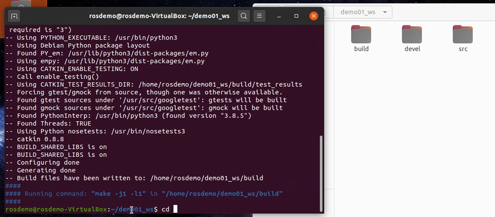

但是对于系统中安装了anaconda的用户，可能存在不止一个python。这时候很可能会因为ROS和anaconda中python版本冲突报错：Invoking “cmake” failed。出现该问题的用户只需要在编译时指名所用的python版本（命令如下）即可成功编译。

```
catkin_make -DPYTHON_EXECUTABLE=/usr/bin/python3
```

## 3、创建功能包

进入src文件夹中

```
cd src
```

创建功能包

```
catkin_create_pkg helloworld roscpp rospy std_msgs
```

helloworld是功能包名，功能包名可自行设置，后面需要跟上roscpp、rospy、std-msgs这些常用依赖。其中roscpp是使用C++实现的库，而rospy则是使用python实现的库，std_msgs是标准消息库，创建ROS功能包时，一般都会依赖这三个库实现。

创建成功后可以在src目录下看到以功能包名字命名的文件夹和配置文件CMakelist.txt.

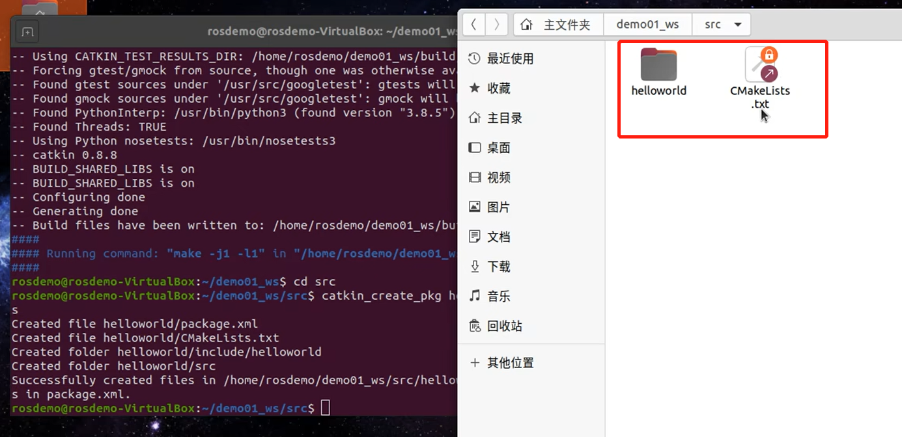

## 4、编辑源文件

#### （1）进入ROS功能包

```
cd helloworld
```

#### （2）添加scripts目录

我们后续的python源文件都存放在该scripts文件中

```
mkdir scripts
```

#### （3）新建一个python文件

```
touch helloworld.py
```

进入新建的python文件，输入python代码

```
#! /usr/bin/env python

"""
    Python 版 HelloWorld

"""
#导包：
import rospy
#编写主入口：
if __name__ == "__main__":
	#初始化ros节点
    rospy.init_node("Hello")
    #输出日志helloworld
    rospy.loginfo("Hello World!!!!")
```

#### （4）为 python 文件添加可执行权限

```
chmod +x 自定义文件名.py
```

chmod是linux中用于改变文件权限的命令，文件有rwx，即读取（r）、写入（w）、执行（x）。我们后面需要执行python文件，所以这里需要打开该文件的执行权限。

## 5、编辑配置文件CamkeList.txt

162—165行，将注释放开，并把自定义文件名填入。该配置可以为python文件选择合适的解释器，noetic版本之前的用户可能不需要配置也可以成功运行。

```
catkin_install_python(PROGRAMS scripts/自定义文件名.py
  DESTINATION ${CATKIN_PACKAGE_BIN_DESTINATION}
)
```

## 6、进入工作空间目录并编译

```
cd 自定义空间名称
catkin_make
```

## 7、进入工作空间目录并执行

#### （1）先启动命令行1：

```
roscore
```

roscore用于启动ros核心，在ros中，所有的节点都是依赖于roscore

#### （2）再启动命令行2：

回到编译结束的窗口，进入开发空间（devel）执行setup.bash，这一步是为了刷新环境变量。

执行文件命令：rosrun 功能包名 自定义文件名

```
cd 工作空间
source ./devel/setup.bash
rosrun helloworld helloworld.py
```

输出结果:`Hello World!!!!`

# 二、ROS通信机制：话题通信

### 1、通信机制及相关代码

```python
import rospy
from std_msgs.msg import String #发布消息类型

"""

使用python实现消息的发布方的流程:

1 导包
2 初始化ros节点
3 创建发布者对象
4 编写发布逻辑并发布数据

"""

if __name__=="__main__":
    #初始化ros节点(传入节点名称即可)
    rospy.init_node("huati")
    #创建发布者对象
    pub = rospy.Publisher("secret",String,queue_size=10)
    #编写发布逻辑并发布数据
    #创建数据
    msg = String()
    #指定发布频率
    rate = rospy.Rate(1)#单位是Hz
    #设置计数器
    count = 0


    #使用死循环发布数据
    while not rospy.is_shutdown():#判断ros节点是否关闭，未关闭则输出false，关闭TRUE,这里没有关闭的时候进入循环体发布数据
        count +=1
        msg.data = "hello"+str(count)
        #发布数据
        pub.publish(msg)
        #日志输出
        rospy.loginfo("话题发布的数据是：%s",msg.data)
        rate.sleep()#根据前面设置的rate，休眠一定时间，使程序按照指定频率输出相关消息
#显示话题发布信息：rostopic echo secret，后面这个是话题发布方的名字
```

```python
#导包
import rospy
from std_msgs.msg import String #导入消息格式

def doMsg(msg):
    rospy.loginfo("我订阅的数据：%s",msg.data)

#编写程序主入口
if __name__=="__main__":
    #初始化ros节点
    rospy.init_node("huahua")
    #创建订阅者对象
    sub = rospy.Subscriber("secret",String,doMsg,queue_size=10)#注意大写
    #回调函数
    #在def doMsg
    rospy.spin()#ros消息回调处理函数，加了这个订阅方才能收到消息

```

### 2、ros的解耦合机制：

即使是不同语言编写的节点也可以互相通信，只要保证发布方和订阅方之间有相同的话题即可。

### 3、自定义发布消息类型：

​        在 ROS 通信协议中，数据载体是一个较为重要组成部分，在上一案例中，ROS 中通过 std_msgs 封装了一些原生的数据类型,比如:String、Int32、Int64、Char、Bool、Empty.... 但是，这些数据一般只包含一个 data 字段，结构的单一意味着功能上的局限性，当传输一些复杂的数据，比如: 激光雷达的信息... std_msgs 由于描述性较差而显得力不从心，这种场景下可以使用自定义的消息类型

自定义消息类型，类似C语言中的结构体，在所用到的数据结构较为复杂的时候使用。

结构是：数据类型 数据名称

流程：

#### （1）新建msg文件

在功能包中新建一个msg文件，写上数据类型和数据名称

```
string name
uint16 age
float64 height
```

#### （2）自定义msg文件所需相关配置

①创建完成后还不能单独使用，需要在package.xml中做相应配置，添加依赖“message_generation”消息生成，需要运行，所以需要导入message_runtime

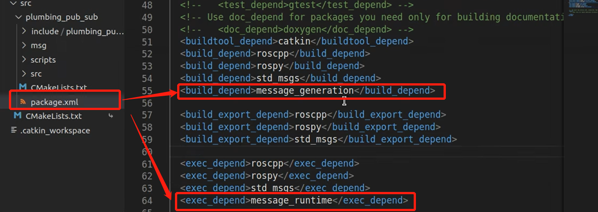

②配置CMakelist

添加依赖包：message_generation

这里find_package是在编译自定义功能包时，所依赖的现有功能包，如果这里添加的依赖包有问题，可能会在编译时报错。


添加自定义message文件，将注释放开，并将示例文件名改为我们自定义的文件名“Person.msg“

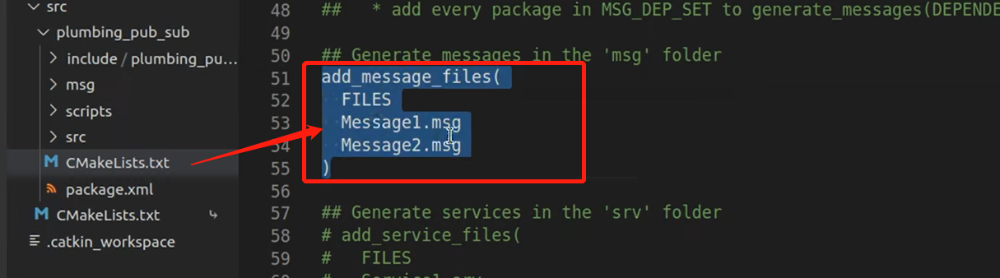

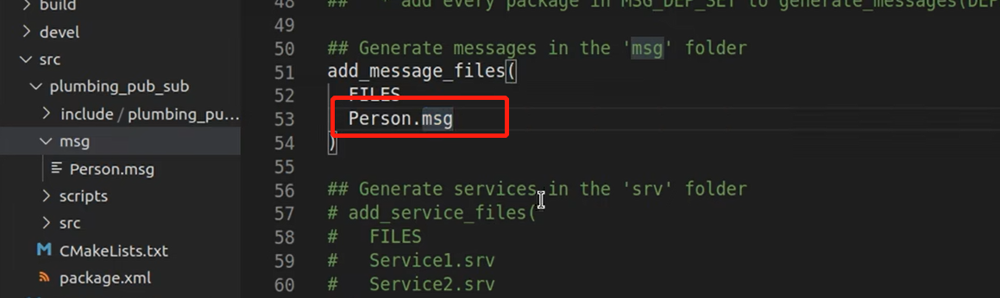

将generation message注释放开


放开注释并添加message_runtime。**这里的catkin_package与前文中的find_package是一种对应关系，自定义功能包依赖于find_package中的功能包，而find-package中的功能包又依赖于catkin_package中的功能包**。他们之间是层层依赖的关系。如果这里添加的依赖包有问题，那么即使编译通过，运行时可能依然会出现报错。

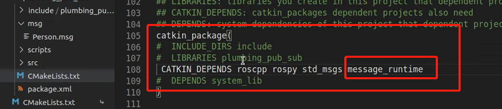

#### （3）编译

ctrl+shift+B即开始编译功能包，未抛出异常即编译成功

编译成功后会生成一些中间文件，我们进入工作空间下的开发空间（devel文件夹），可以看到lib文件夹下python3文件夹中生成了_Person.py文件，里面包含了刚才新建的几个量，后续就可以调用。
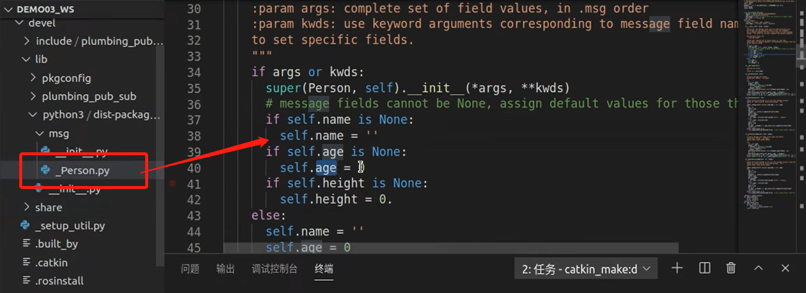

# 三、ROS通信机制：服务通信

## 1、服务通信机制及示意图    

服务通信适用于对实时性有要求，具有一定逻辑处理功能的应用场景。以请求相应的模式实现不同节点之间数据交互的一种通信方式。服务通信和话题通信的区别在于，服务通信是请求应答机制，当客户端发起请求时，服务端才会发送数据，而话题通信是订阅后，订阅方被动接收发布方所有信息。且服务通信机制是可以多对多的。

服务通信机制示意图：


##  2、服务通信具体实现流程

**demo：实现两个整型数相加求和，客户端发送两个整型数，服务端对其求和。**

​        服务通信也需要自定义服务数据类型，即自定义srv文件，该过程和自定义msg文件非常类似。主要实现流程分为以下三步：①按照固定格式创建srv文件②编辑相关配置文件③编译生成中间文件

​        开始之前首先要在工作空间中的src文件夹中新建一个功能包，可以用catkin_create_pkg 功能包名  依赖，建立一个新的功能包。这里我命名为server_client。

### （1）按照固定格式创建srv文件

​        在新建功能包server_client中新建一个文件夹命名为srv,在srv文件中新建文件命名为AddInts.srv用于存放我们的消息载体。


srv文件中存放的变量结构体按照请求和响应分为两部分，用---隔开


### （2）编辑配置文件package.xml和CMakelist.txt

①首先编辑package.xml文件

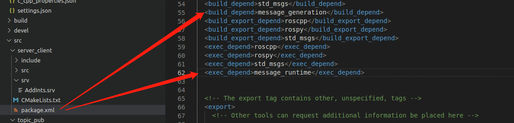

②编辑CMakelist.txt文件

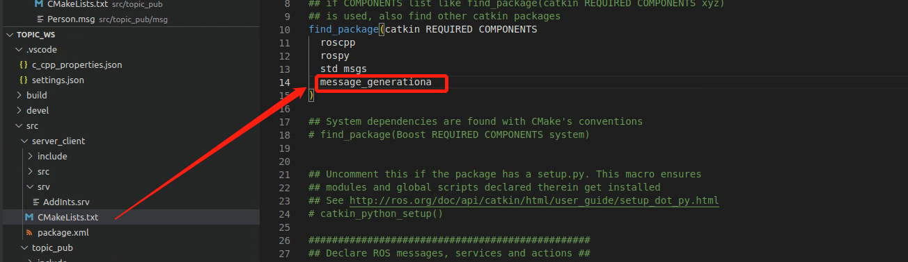

注意下面这个不同于话题通信，需要配置srv相关部分，将注释放开，并把我们新建的AddInts.srv更换到文件下面


将generate_messages注释放开，因为这里虽然我们的通信数据格式是自定义的，但是它的产生依然依赖于标准包std_msgs


放开注释catkin_packages，类似话题通信，这里也是为了满足包之间的依赖关系。


到这里呢，我们的配置就终于完成啦~接下来进入编译环节

（3）编译生成中间文件

```
ctrl+shift+B
```

可以看到我们的编译并未抛出异常


如果这里报错“Invoking “cmake”failed，很有可能是包名写错啦，回去检查一下重新编译就好啦

### （3）编译生成中间文件

可以看到我们已经在开发空间devel中产生了一些后续被调用到的文件。这样我们的数据结构文件就配置好啦~可以进行下一步的开发咯

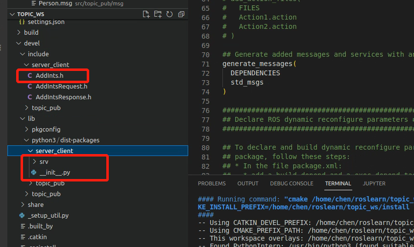

###  （4）自定义srv文件的调用

模型实现中：rosmaster可以通过roscore启动，建立连接的具体过程已被官方封装好

我们需要做的工作主要分为以下三个部分：①服务端程序编写②客户端程序编写③数据

#### VScode配置

​        使用自定义srv文件时，需要对VScode进行一些配置，这样可以使VS提供对应的语法高亮，便于我们编程，也能防止VScode误抛异常。不配置也不影响使用。

#### 服务端代码实现

定位到功能包，新建文件夹scripts，新建文件server.py

创建服务对象用到的函数rospy.Service（”话题名“，数据类型，回调函数），话题名自定义（服务端和客户端需要保持一致），数据类型取决于srv文件的自定义名称，回调函数自己编写和spin()成对出现。

```python
#! /usr/bin/env python
import rospy
from server_client.srv import AddInts,AddIntsRequest,AddIntsResponse
#这里可以import*，不用写清楚具体的类和对象，这样会把该文件的所有对象都导入，但是要注意文件大的时候这样处理会变慢很多


"""
服务端：解析客户需求，产生响应
1、导包
2、初始化ros节点
3、创建服务端对象
4、数据处理逻辑(回调函数)
5、spin()

"""

#参数：封装了请求数据
#返回值：响应数据
def doAdd(request):
    #解析请求提交的两个数字
    num1 = request.num1
    num2 = request.num2
    #对解析出的数字进行求和
    sum = num1+num2
    #创建响应对象，将返回值封装入响应对象
    response = AddIntsResponse()
    response.sum = sum
    rospy.loginfo("服务器解析的数据是num1=%d,num2=%d,求和结果sum=%d",num1,num2,sum)
    return response


if __name__=="__main__":
    #初始化ROS节点
    rospy.init_node("fuwu")
    #创建服务对象,注意函数大小写,数据类型取决于srv文件的文件名
    server = rospy.Service("addints",AddInts,doAdd)
    rospy.loginfo("服务器已经启动了")
    rospy.spin()
```

配置CMakelist.txt


改变文件可执行权限，source刷新环境变量，rosrun运行，可以看到服务器启动了


客户端还未编写，我们这里可以用命令模拟客户端来测试服务端的功能,call后面要加自定义的建立通信链接的话题名,之后可以tab键自动补齐数据结构类型，手动修改数据并执行即可测试。

```
rosservice call addints "num1:1,num2:2"
```


#### 客户端代码实现

定位到功能包，新建文件夹scripts，新建文件client.py

创建客户对象用到的函数rospy.ServiceProxy（”话题名“，消息数据类型），话题名和服务端保持一致，数据类型同服务端，取决于srv文件，这里是AddInts。

请求数据并发送请求：client.call(num1,num2)

```python
#! /usr/lib/env python
import rospy
from server_client.srv import AddInts,AddIntsRequest,AddIntsResponse
"""
1、导包
2、初始化ros节点
3、创建客户端对象
4、组织请求数据,并发送请求
5、处理响应
"""

if __name__=="__main__":
    rospy.init_node("kehu")
    #创建客户端对象
    client = rospy.ServiceProxy("addints",AddInts)
    #组织请求数据,并发送请求
    response = client.call(12,23)
    #处理响应,这里直接打印一下
    rospy.loginfo("响应求和之后的数据是%d",response.sum)

```

程序执行结果

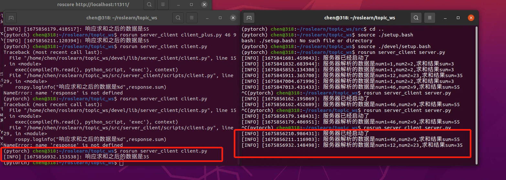

优化实现：
可以在执行节点时，动态传入参数
用到模块sys中的argv。这个可以包含节点名称和传入的数据

```python
#! /usr/lib/env python
import rospy
from server_client.srv import AddInts,AddIntsRequest,AddIntsResponse
import sys

"""
1、导包
2、初始化ros节点
3、创建客户端对象
4、组织请求数据,并发送请求
5、处理响应


问题：
    当客户端先于服务端启动时,程序会抛出异常,但是ROS节点在启动时是没有先后顺序的,那么在程序执行过程中可能会出现一些问题
解决方案：
    当客户端先于服务端启动时，不要抛出异常，而是要挂起等待。等待服务器启动后，再次发送请求
实现代码：
    ROS中的内置函数，判断服务器的状态，服务端未启动时客户端挂起。
    法一：client.wait_for_service()，不需要传入话题名称，它本身可以查找话题名
    法二：rospy.wait_for_service("话题")rospy需要传入参数话题名称
"""

if __name__=="__main__":

    #判断参数长度,由于节点名也算一个参数，argv[0]是节点名，所以这里是3
    if len(sys.argv)!=3:
        rospy.logerr("传入的参数个数不对")
        sys.exit(1)

    rospy.init_node("kehu")
    #创建客户端对象
    client = rospy.ServiceProxy("addints",AddInts)
    #组织请求数据,并发送请求，argv[1]这里是字符串类型，需要强行将其转换为int类型
    num1 = int(sys.argv[1])
    num2 = int(sys.argv[2])
    #等待服务器启动
    #client.wait_for_service()
    #法二
    rospy.wait_for_service("addints")
    response = client.call(num1,num2)
    #处理响应,这里直接打印一下
    rospy.loginfo("响应求和之后的数据是%d",response.sum)
```

​        从程序执行结果可以看到，可以动态输入num1和num2，crtl C关闭服务端后，先执行客户端，客户端程序不会抛出异常而是会挂起等待，开启服务端后正常响应。

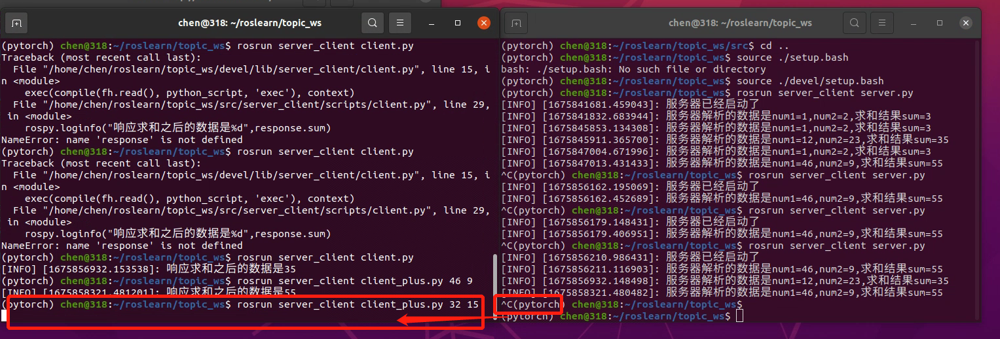

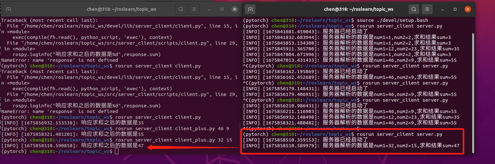

# 四、ROS通信机制：参数服务器

​       参数服务器在ROS中主要用于实现不同节点之间的数据共享。参数服务器相当于是独立于所有节点的一个公共容器，可以将数据存储在该容器中，被不同的节点调用，当然不同的节点也可以往其中存储数据，关于参数服务器的典型应用场景如下:

> 导航实现时，会进行路径规划，比如: 全局路径规划，设计一个从出发点到目标点的大致路径。本地路径规划，会根据当前路况生成时时的行进路径，上述场景中，全局路径规划和本地路径规划时，就会使用到参数服务器：路径规划时，需要参考小车的尺寸，我们可以将这些尺寸信息存储到参数服务器，全局路径规划节 点与本地路径规划节点都可以从参数服务器中调用这些参数

​     参数服务器，一般适用于存在数据共享的一些应用场景。存储一些多节点共享的数据，类似编程语言中的全局变量。

参数服务器实现是最为简单的，该模型如下图所示,该模型中涉及到三个角色:

- ROS Master (管理者)
- Talker (参数设置者)
- Listener (参数调用者)

ROS Master 作为一个公共容器保存参数，Talker 可以向容器中设置参数，Listener 可以获取参数。

## 1、参数服务器的新增和修改

```python
#! /usr/bin/env python

import rospy
"""
示例：服务器参数的新增与修改
需求：在参数服务器中设置机器人的属性、型号、半径
所用函数:rospy.set_param()


"""
if __name__=="__main__":
    #初始化ROS节点
    rospy.init_node("param_set")
    #新增参数,键值对（类似python字典语法）
    rospy.set_param("name","car")
    rospy.set_param("radius",0.15)
```

之后正常修改配置文件CMakelist，增加文件可执行权限，ctrl+shift+B编译，再sourece后执行文件即可执行成功，由于该程序没有日志输出，所以终端没有任何显示。

我们可以通过ros命令来查看我们刚才设置的服务器参数和值

**查看参数列表：rosparam list**

**获取参数值：rosparam get 键名**


修改参数只需要用同样的函数输入键值然后传入新的参数即可。

## 2、参数服务器获取参数（参数查询）

可用函数：
（1）get_param(键，默认值)当该键存在时返回它的值，不存在时会返回第二个参数设定的默认值
（2）get_param_cached，和（1）相同，但是查询过会放在缓存中，下次不用反复到服务器查询，效率更高
（3）get_param_names。列出当前参数列表，包括自定义的和系统自带的
（4）has_param，查询某个参数是否存在，返回bool类型，是/否
（5）search_param，查询某个参数是否存在，存在则返回键名

```python
#! /usr/lib/env python

import rospy

"""
示例：参数的查询
可用函数：
get_param(键，默认值)当该键存在时返回它的值，不存在时会返回第二个参数设定的默认值
get_param_cached
get_param_names
has_param
search_param
"""

if __name__=="__main__":
    rospy.init_node("get_param")
    radius = rospy.get_param("radius",0.5)
    radius22 = rospy.get_param("radius22",0.6)
    rospy.loginfo("radius的值是%.2f",radius)
    rospy.loginfo("radius22的值是%.2f",radius22)

    #get_param_cached 和get_param功能是完全一样的，但是cached查询过后会将结果放在缓存里，下次无需到服务器查询，效率更高。
    radius = rospy.get_param_cached("radius",0.5)
    radius22 = rospy.get_param_cached("radius22",0.6)
    rospy.loginfo("radius的值是%.2f",radius)
    rospy.loginfo("radius的值是%.2f",radius22)

    #get_param_names,列出当前系统中的参数列表，包括自定义的和系统自带的
    # names = rospy.get_param_names()
    # for name in names:
    #     rospy.loginfo = ("name=%s",name)

    #has_param,判断该参数是否存在
    flag1 = rospy.has_param("radius")
    if flag1:
        rospy.loginfo("radius 存在")
    else:
        rospy.loginfo("radius 不存在")

    #search_param,用于查询某个建是否存在，存在即返回键的名称
    key = rospy.search_param("radius")
    rospy.loginfo("key = %s",key)
```

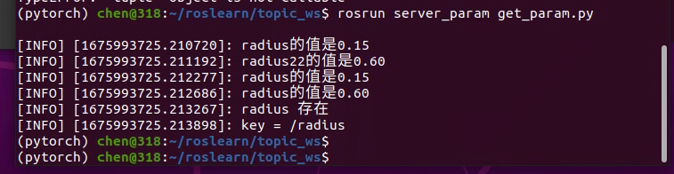

## 3、参数服务器删除参数

 使用函数：rospy.delete_param("radius")

但是只使用这一句命令进行参数删除时，如果重复执行，就会报错，该参数不存在。故而这里用try：except，else语句进行处理，如果异常就输出该参数不存在，执行成功即输出该参数被成功删除。

```python
#! /usr/lib/env python

import rospy
"""
示例：参数的删除
函数：delete_param()
"""
if __name__ == "__main__":
    rospy.init_node("delete_param")
    try:
        rospy.delete_param("radius")
    except Exception:
        rospy.loginfo("不存在该参数或该参数已经被删除过了")
    else:
        rospy.loginfo("参数删除成功！")

```


# 五、ROS常用命令

本节中的ros命令是动态的，是在ros节点启动后动态的获取其相关参数信息的方式 

1、rosnode：操作节点

```
rosnode ping    测试到节点的连接状态
rosnode list    列出活动节点
rosnode info    打印节点信息
rosnode machine    列出指定设备上节点
rosnode kill    杀死某个节点
rosnode cleanup    清除不可连接的节点（ctrl+C退出后，roscore列表中仍然存在，该命令可以清除这些僵尸节点）
```

2、rostopic

```
rostopic bw 话题名    ：显示主题使用的带宽
rostopic delay 话题名 ：显示带有 header 的主题延迟
rostopic echo  话题名： 打印消息到屏幕
rostopic find   根据类型查找主题
rostopic hz     显示主题的发布频率
rostopic info 话题名：  显示主题相关信息
rostopic list   显示所有活动状态下的主题
rostopic pub 话题名：将数据发布到主题，自定义消息按tab自动补齐，手动填入相关信息即可发布
rostopic type   打印主题类型
```

3、rosmsg：

```
rosmsg show 包名/消息名称 ：   显示消息描述
rosmsg info 包名/消息名称 ：  显示消息信息
rosmsg list ：  列出所有消息
rosmsg list |grep -i 消息名：使用管道列出该消息文件里的消息
rosmsg md5    显示 md5 加密后的消息
rosmsg package    显示某个功能包下的所有消息
rosmsg packages    列出包含消息的功能包
```

4、rosservice：

```
rosservice args 服务名：打印服务参数
rosservice call    使用提供的参数调用服务
rosservice find    按照服务类型查找服务
rosservice info 包名/服务名：   打印有关服务的信息
rosservice list    列出所有活动的服务
rosservice type    打印服务类型
rosservice uri    打印服务的 ROSRPC uri
```

5、rosparam

rosparam包含rosparam命令行工具，用于使用YAML编码文件在参数服务器上获取和设置ROS参数。

```
rosparam set    设置参数
rosparam get    获取参数
rosparam load    从外部文件加载参数
rosparam dump    将参数写出到外部文件
rosparam delete    删除参数
rosparam list    列出所有参数
```

# 六、ROS通信机制实操案例：

## demo 01 控制小乌龟做圆周运动

1、正常启动键盘控制乌龟节点：

roscore——rosrun turtlesim turtlesim_node——rosrun turtlesim turtle_teleop_key

2、用ros命令查看当前话题名和消息类型，方便下一步自行编码完成控制乌龟运动

（1）rostopic list查看当前话题名称，rqt_graph查看计算图的结构，可以看到话题名


看到当前两个节点通信的话题是/turtle1/cmd_vel

（2）获取话题的消息类型

rostopic info 

rostopic type 

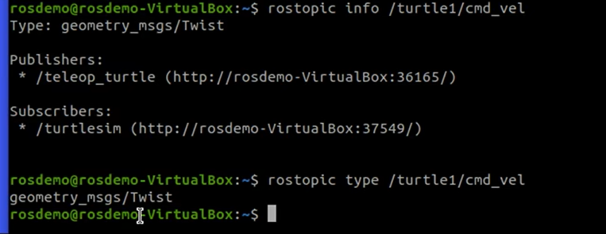

(3)获取消息格式

rosmsg show/info


线速度角速度的含义也讲了

（4）控制乌龟运动完全类似话题发布方程序的编写

```python
#! /usr/bin/env python

import rospy
from geometry_msgs.msg import Twist

"""
发布方：
需要获取话题名和消息类型
话题：/turtle1/cmd_vel
消息类型:geometry/Twist

"""
if __name__=="__main__":
    rospy.init_node("control")
    #创建发布者对象
    pub = rospy.Publisher("/turtle1/cmd_vel",Twist,queue_size=10)
    #组织并发布数据
    #设置发布频率
    rate = rospy.Rate(10)
    #创建速度消息
    twist = Twist()
    twist.angular.z = 1
    twist.angular.x = 0
    twist.angular.y = 0
    twist.linear.x = 1
    twist.linear.y = 0
    twist.linear.z = 0
    #循环发布数据
    while not rospy.is_shutdown():
        pub.publish(twist)
        rate.sleep()
```


## demo 02 订阅乌龟的位姿

完全类似话题订阅方程序的编写

```python
#! /usr/bin/env python
import rospy
from turtlesim.msg import Pose
"""
需求：订阅输出乌龟位资
1、导包
2、初始化ros节点
3、创建订阅对象
4、使用回调函数处理订阅到的消息
5、spin
"""
def sub_pose(pose):
    rospy.loginfo("乌龟位姿信息：坐标（%.2f,%.2f）,朝向：%.2f，线速度：%.2f，角速度：%.2f。",pose.x,pose.y,pose.theta,pose.linear_velocity,pose.angular_velocity)

if __name__=="__main__":
    rospy.init_node("subpose")
    sub = rospy.Subscriber("/turtle1/pose",Pose,sub_pose,queue_size = 100)
    rospy.spin()
```

在这里编写程序有一个误区，误以为这个是和动作发布方直接通信的，所以话题一开始采用/turtle1/cmd_vel时一直报错，后来发现这个是订阅了/turtle1/pose话题，输出rqt图就可以非常清晰的看到这些节点之间的关系。

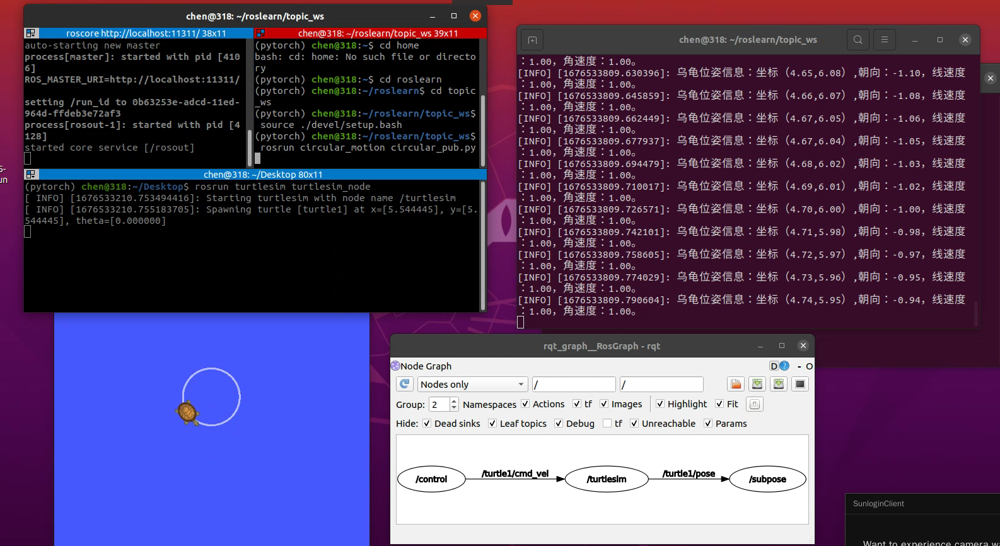

## demo 03 通过服务通信实现在指定位置生成一只乌龟

（1）使用rosservice list命令获取当前存在的服务列表，/spawn是生成乌龟的服务

（2）使用rosservice info spawn可以看到该服务的一些细节信息

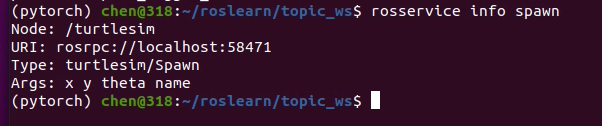

可以看到①/turtlesim节点提供了该服务②URI③服务的消息类型（重要）④服务的参数（xy坐标位置，角度，名字）

（3）调用rossrv info/show 消息类型名，查看该消息类型的具体信息格式


（4）通过命令的方式调用服务并生成一只乌龟

rosservice call 服务名字 tab键补齐会显示需要输入服务请求参数

rosservice call /spawn

（5）通过编码方式调用服务生成一只乌龟

```python
#! /usr/bin/env python
import rospy
from turtlesim.srv import Spawn,SpawnRequest,SpawnResponse
"""
需求：向服务器发送请求，生成一只小乌龟
话题：spawn
消息类型：/turtlesim/Spawn

"""
#编写主入口
if __name__=="__main__":
    #初始化ros节点
    rospy.init_node("generate_turtle")
    #创建请求对象
    client_gene = rospy.ServiceProxy("/spawn",Spawn)
    #组织数据并发送请求
    request = SpawnRequest()
    request.x = 3.0
    request.y = 9.0
    request.theta = 0.9
    request.name = "littleturtle2"
    #判断服务端是否开启，未开启则挂起等待
    client_gene.wait_for_service()
    try:
        reponse = client_gene.call(request)
        #处理响应结果
        rospy.loginfo("生成乌龟的名字叫：%s",reponse.name)
    except:
        rospy.logerr("请求失败！重复执行或其他异常")
```

## demo 04 修改背景参数

（1）通过ros命令的方式修改

rosparam list

rosparam get

rosparam set

（2）通过编码方式实现

```python
#! /usr/bin/env python
import rospy
"""
需求：修改乌龟gui背景色
1、初始化ros节点
2、设置参数
"""
if __name__=="__main__":
    rospy.init_node("set_param")
    rospy.set_param("/turtlesim/background_r",10)
    rospy.set_param("/turtlesim/backgroung_g",200)
    rospy.set_param("/turtlesim/background_b",40)
```

## 常用API介绍

1、rospy.init_node()

2、rospy.Publisher()创建发布者对象

3、spin（）回旋函数：进入循环，在循环中处理回调函数

4、时间相关的API

5、节点关闭相关的API

## 自定义python模块的导入

需要自己导入临时环境变量，指明新增文件的路径。

# 七、ROS运行管理

ros是多进程的分布式框架

## 1、元功能包

​       将实现某一功能的具有内在逻辑联系的一些功能包打包在一起成为元功能包。元功能包可以方便用户的使用，安装时可以将其他打包的相关功能包一并下载。（注意元功能包的操作对象是不同的功能包）

（1）新建功能包：自定义命名即可，由于元功能包是一个空包无需添加依赖

（2）修改package.xml文件

添加可执行依赖，如图所示可以在注释里复制一个


将声明依赖的包换成准备打包在一起的各个功能包名并添加虚拟元包\<metapackage>可以将这些包关联起来


（3）修改CMakelist.txt文件

保留红框中的三行，其余内容以及注释全部删掉


添加元功能包部分，（注意这几行之间不能有任何空行）


编译即可完成

## 2、launch文件（ros节点管理）

launch文件是xml格式，可以一次性启动多个功能节点。

以键盘控制小乌龟运动为例的实现步骤：

（1）在src文件中新建一个功能包，命名为launch01，并添加依赖turtlesim rospy roscpp std_msgs

（2）在该功能包中新建一个文件，一般就命名为launch

（3）在launch文件夹中新建一个以.launch为后缀名的文件，这里命名为startturtle.launch

（4）编辑.launch文件的内容：根标签\<launch>，子级标签是需要一起启动的节点名


（5）source刷新环境变量，使用命令：roslaunch 功能包名 .launch文件名 执行文件即可

注意：roslaunch会主动判断是否启动roscore，未启动会自动启动roscore，所以无需手动启动


## 3、launch标签知识点总结归纳

（1）deprecated标签：输出过时警告，该launch文件不建议继续使用，可以找新版本的

（2）node标签：用于指定ros节点，但由于节点启动是多进程的，执行时未必按照node标签的声明顺序进行启动

（3）include标签：用于实现代码复用，将另一个xml格式的launch文件导入到当前文件

```python
<include file="$(find 被复用文件所在功能包名)/launch/被复用文件名"/>
```

（4）remap标签：用于话题重命名，更改某节点订阅的话题名实现不同节点之间的灵活通信

（5）param标签：为参数服务器设置参数，可以设置全局参数（launch里，node外），也可以设置节点内的参数（node标签里）

（6）rosparam标签：主要是从yaml文件中导入参数

（7）group标签：为ros节点分组，比如当想启动两套一样的节点时，为了防止重名问题，可以进行分组

（8）arg标签：传参，封装参数值，公用一个变量时可以重复传参（宏定义）

## 4、ROS中的重名问题

### （1）工作空间覆盖（功能包重名）

在不同工作空间中存在重名的功能包时，后刷新的环境变量起作用。

解决方式可以设置命名空间或者起别名（名称重映射）

### （2）ROS节点名称重名

​       命名空间就是为名称添加前缀，名称重映射是为名称起别名。这两种策略都可以解决节点重名问题，两种策略的实现途径有多种:

- rosrun 命令

  ①命名空间__ns:=xx 通过后面ns名称不同区分，从而可以启动多个节点

  ```
  rosrun turtlesim turtlesim_node  __ns:=mingcheng
  ```

  ②名称重映射（起别名）

  ```
  rosrun turtlesim turtlesim_node __name:=dabao
  rosrun turtlesim turtlesim_node __name:=xiaobao
  ```

  注意：两种方式可以同时组合使用

- launch 文件

  ```html
  <launch>
      <node pkg="turtlesim" type="turtlesim_node" name ="turtlesim"/>
      <!-- 名称重映射-->
      <node pkg="turtlesim" type="turtlesim_node" name = "t1"/>
      <!-- 命名空间方法 -->
      <node pkg="turtlesim" type="turtlesim_node" name = "turtlesim" ns = "huahua"/>
      <!-- 组合方法 -->
      <node pkg="turtlesim" type="turtlesim_node" name = "t2" ns="baobao"/>
  </launch>
  ```

- 编码实现：API：anonymous=true时会给节点添加随机后缀，避免节点重名

### （3）ROS话题名称重名问题

- rosrun 命令

  案例：用键盘控制节点rosrun teleop_twist_keyboard teleop_twist_keyboard.py（默认使用节点名时cmd_vel）控制turtlesim_node的乌龟运动（默认使用turtle/cmd_vel节点）。

  方法：将其中一个节点名改成另一个，节点名称一致后才可以实现通信从而控制小乌龟运动

```
rosrun turtlesim turtlesim_node /turtle1/cmd_vel:=/cmd_vel
```

​       或

```
rosrun teleop_twist_keyboard teleop_twist_keyboard.py /cmd_vel:=/turtle1/cmd_vel
```

- launch文件

```html
<!-- 键盘控制乌龟运动 -->
<launch>
    <!-- 将乌龟的话题设置为与键盘控制一致 -->
    <node pkg="turtlesim" type="turtlesim_node" name="turtlesim">
        <remap from="/turtle1/cmd_vel" to="/cmd_vel"/>
    </node>
    <node pkg="teleop_twist_keyboard" type="teleop_twist_keyboard.py" name="key"/>
    <!--将键盘控制话题设置为与乌龟一致，完全类比即可-->
</launch>
```

# 八、ROS常用组件

## 1、TF坐标变换

### （1）静态坐标变换

#### 法一：编码实现

①创建功能包并添加依赖

```
catkin_create_pkg tf_static roscpp rospy std_msgs tf2 tf2_ros tf2_geometry_msgs geometry_msgs
```

②新建python文件，为文件添加可执行权限，修改CMakelists文件

③编写发布方代码，编译执行

```python
#! /usr/bin/env python
import rospy
import tf2_ros
from geometry_msgs.msg import TransformStamped
import tf.transformations #欧拉角获取四元数
"""
发布方实现：用于发布两个坐标系的新相对关系（小车底盘——baselink和雷达——laser）
流程：1、导包
    2、初始化ROS节点
    3、创建发布对象
    4、组织被发布的数据
    5、循环发布数据
    6、spin（）
"""
if __name__=="__main__":
    rospy.init_node("tf_static_pub")
    #创建发布对象
    pub = tf2_ros.StaticTransformBroadcaster()
    #组织被发布的数据
    ts = TransformStamped()
    #header
    ts.header.stamp=rospy.Time.now()#设置时间戳
    ts.header.frame_id = "baselink"#父级坐标系
    #child fram
    ts.child_frame_id = "laser"

    #相对关系（偏移和四元数）
    ts.transform.translation.x = 0.2
    ts.transform.translation.y = 0.0
    ts.transform.translation.z = 0.5
    #四元数：一般先设置欧拉角，再转换成四元数
    qtn = tf.transformations.quaternion_from_euler(0,0,0)#是一个列表对象，可以下标索引获取对应的值
    #四元数获取
    ts.transform.rotation.x =qtn[0]
    ts.transform.rotation.y = qtn[1]
    ts.transform.rotation.z = qtn[2]
    ts.transform.rotation.w = qtn[3]

    #发布数据
    pub.sendTransform(ts)
    rospy.spin()
```

④查看发布方发布的数据

rostopic list，可以看到有话题名为tf_static的话题

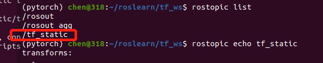

rostopic echo tf_static可以看到发布的具体信息


也可以借助可视化工具rviz直观看到两个坐标系

（终端中输入rviz打开可视化窗口，左上角Fixed Frame选择baselink，左下角add，添加TF即可看到）

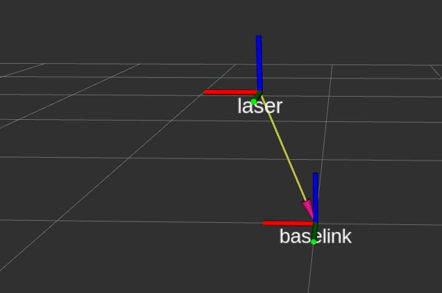

④订阅方代码编写

新建python文件tf_static_sub.py，为文件添加可执行权限，修改CMakelists文件

```python
#! /usr/bin/env python
import rospy
import tf2_ros
from tf2_geometry_msgs import tf2_geometry_msgs
"""
订阅方实现：
订阅坐标变换消息，传入被转换的坐标点，调用转换算法实现坐标转换
1、导包（用到什么包导入什么包）
2、初始化ros节点
3、创建订阅对象
4、组织被转换的坐标点
5、转换逻辑编写（调用tf封装算法）
6、输出转换结果B
7、spin（）/spinonce（）
"""
if __name__=="__main__":
    #初始化ros节点
    rospy.init_node("static_tf_pub")
    #创建订阅对象
    buffer = tf2_ros.Buffer() #创建缓存对象
    sub = tf2_ros.TransformListener(buffer)#将缓存对象传入
    #组织被转换的坐标点
    ps = tf2_geometry_msgs.PointStamped()#可以用rosmsg info geometry_msgs.PointStamped 查看消息结构
    ps.header.stamp = rospy.Time.now()
    ps.header.frame_id = "laser"
    ps.point.x = 2.0
    ps.point.y = 3.0
    ps.point.z = 5.0
    #转换逻辑实现，由于雷达是不间断获取信息的，这里用循环发布数据来模拟
    rate = rospy.Rate(10)
    while not rospy.is_shutdown():
        try:
            #转换：buffer提供了对应的转换函数
            ps_out = buffer.transform(ps,"baselink")
            rospy.loginfo("转换后的坐标结果:(%.2f,%.2f,%.2f)当前参考的坐标系：%s",ps_out.point.x,ps_out.point.y,ps_out.point.z,ps_out.header.frame_id) 
        except:
            rospy.logwarn("错误提示：%s",Exception)
        rate.sleep()
```

#### 法二：ros封装命令实现静态坐标转换

```
rosrun tf2_ros static_transform_publisher x偏移量 y偏移量 z偏移量 x轴偏转角 y轴偏转角 z轴偏转角 父坐标系名 子坐标系名
```

### （2）动态坐标变换

案例：实现小乌龟运动时，实时显示乌龟位姿与原点的相对关系，并能够在rviz中实时观察到两坐标的相对位置

实现思路：发布方订阅乌龟运动的位姿信息，建立乌龟（子级坐标系）与原点（父级坐标系）并发布相对关系，订阅方订阅到两坐标系并输出乌龟相对原点的动态变换坐标。

注意：这里的发布方订阅了内置节点乌龟运动的信息，其实是个嵌套实现

①发布方编码实现

```python
#! /usr/bin/env python
import rospy
from turtlesim.msg import Pose
import tf2_ros
from geometry_msgs.msg import TransformStamped
import tf.transformations
"""
发布方实现：
订阅乌龟的位姿信息，转换成坐标系的相对关系并发布
准备：了解乌龟位姿的话题和消息类型：话题是turtle1/pose，类型turtlesim/Pose
流程：
1、导包
2、初始化ros节点
3、创建订阅对象
4、回调函数处理订阅到的消息（核心）
5、spin（）
"""
def doPose(pose):
    #创建发布坐标系相对关系的对象
    pub = tf2_ros.TransformBroadcaster()
    #将Pose转换成坐标系相对关系的消息
    ts = TransformStamped()
    ts.header.frame_id = "world"
    ts.header.stamp = rospy.Time.now()
    ts.child_frame_id = "turtle1"
    #transform,坐标系子级坐标系相对于父级坐标系的偏移量
    ts.transform.translation.x = pose.x
    ts.transform.translation.y = pose.y
    ts.transform.translation.z = 0
    #ts下的rotation，通过四元数设置方向上的偏转角（一般需要一个欧拉角的转换过程）
    """
    乌龟是2D对象，不存在x向的翻滚，y向的俯仰，只有z向上的转向（偏航）
    欧拉角（0，0 ，pose.theta）
    """
    qtn = tf.transformations.quaternion_from_euler(0,0,pose.theta)
    ts.transform.rotation.x = qtn[0]
    ts.transform.rotation.y = qtn[1]
    ts.transform.rotation.z = qtn[2]
    ts.transform.rotation.w = qtn[3]
    #发布
    pub.sendTransform(ts)   

if __name__=="__main__":
    rospy.init_node("dynamic_pub")
    #创建订阅对象
    sub = rospy.Subscriber("/turtle1/pose",Pose,doPose,queue_size = 100)
    rospy.spin()
```

②订阅方编码实现

这里要格外注意时间戳要置0，采用rospy.Time()，如果仍然采用rospy.Time.now获取当前，坐标转换会因为时间戳相差较大而无法完成转换从而抛出异常。

```python
#! /usr/bin/env python
import rospy
import tf2_ros
from tf2_geometry_msgs import tf2_geometry_msgs
"""
订阅方实现：
订阅坐标变换消息，传入被转换的坐标点，调用转换算法实现坐标转换
1、导包（用到什么包导入什么包）
2、初始化ros节点
3、创建订阅对象
4、组织被转换的坐标点
5、转换逻辑编写（调用tf封装算法）
6、输出转换结果B
7、spin（）/spinonce（）
"""

if __name__=="__main__":

    #初始化ros节点
    rospy.init_node("static_tf_pub")
    #创建订阅对象
    buffer = tf2_ros.Buffer() #创建缓存对象
    sub = tf2_ros.TransformListener(buffer)#将缓存对象传入
    #组织被转换的坐标点
    ps = tf2_geometry_msgs.PointStamped()
    #时间戳 0 
    ps.header.stamp = rospy.Time()
    ps.header.frame_id = "turtle1"
    rate = rospy.Rate(10)
    while not rospy.is_shutdown():
        try:
            #转换：buffer提供了对应的转换函数
            ps_out = buffer.transform(ps,"world")
            rospy.loginfo("转换后的坐标结果:(%.2f,%.2f,%.2f)当前参考的坐标系：%s",ps_out.point.x,ps_out.point.y,ps_out.point.z,ps_out.header.frame_id) 
        except:
            rospy.logwarn("错误提示：%s",Exception)
        rate.sleep()
```

③运行

启动roscore，启动乌龟GUI节点和键盘控制节点，分别rosrun发布方和订阅方，打开rviz，可以看到键盘控制乌龟运动时，会实时输出乌龟相对原点坐标的位置信息和坐标的动态变化图


### （3）多坐标变换

①按照静态坐标变换的法二发布两个静态相对坐标关系：son1与world和son2与world，并用launch文件封装起来

```html
<launch>
    <!-- 发布son1相对于world以及son2相对于world的坐标关系 -->
    <node pkg="tf2_ros" type="static_transform_publisher" name="son1" args="5 0 0 0 0 0 /world /son1" output="screen"/>
    <node pkg="tf2_ros" type="static_transform_publisher" name="son2" args="3 0 0 0 0 0 /world /son2" output="screen"/>
</launch>
```

②类比动态坐标变换编写代码

```python
#! /usr/bin/env python
import rospy
import tf2_ros
from tf2_geometry_msgs import tf2_geometry_msgs
from geometry_msgs.msg import TransformStamped

if __name__=="__main__":

    #初始化ros节点
    rospy.init_node("static_tf_pub")
    #创建订阅对象
    buffer = tf2_ros.Buffer() #创建缓存对象
    sub = tf2_ros.TransformListener(buffer)#将缓存对象传入
    #组织被转换的坐标点
    ps = tf2_geometry_msgs.PointStamped()
    #时间戳 0 
    ps.header.stamp = rospy.Time.now()
    ps.header.frame_id = "son1"
    ps.point.x = 1.0
    ps.point.y = 2.0
    ps.point.z = 3.0
    #转换逻辑实现
    rate = rospy.Rate(10)
    while not rospy.is_shutdown():
        try:
            #计算son1相对于son2的转换关系
            ts = buffer.lookup_transform("son2","son1",rospy.Time(0))
            rospy.loginfo("父级坐标系：%s，
                          子级坐标系：%s",
                          ts.header.frame_id,
                          ts.child_frame_id)
            #转换：buffer提供了对应的转换函数
            ps_out = buffer.transform(ps,"son2")
            rospy.loginfo("转换后的坐标结果:(%.2f,%.2f,%.2f)当前参考的坐标系：%s",ps_out.point.x,ps_out.point.y,ps_out.point.z,ps_out.header.frame_id) 
        except:
            rospy.logwarn("错误提示：%s",Exception)
        rate.sleep()
```

（4）坐标关系查看工具tf2_tools

首先调用rospack find tf2_tools查看是否包含该功能包，如果没有，请使用如下命令安装:

```
sudo apt install ros-noetic-tf2-tools
```

注意使用该工具的前提是，已经启动了坐标相对关系变换的节点

使用命令查看坐标相对关系

```
rosrun tf2_tools view_frames.py
```

接下来会自动解析当前启动的坐标并输出一个pdf文件，显示坐标间的相对关系，可以在执行这条命令的路径下找到该pdf文件并打开


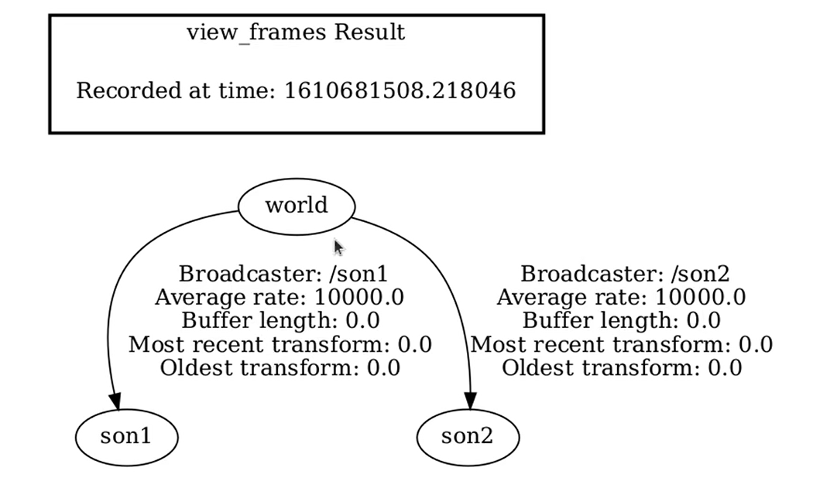

## 2、rosbag节点录制与回放

在ROS中提供数据得留存和读取实现，主要功能是录制与回放，可以实现数据复用，便于调试和测试

1.准备

创建目录保存录制的文件

```
mkdir ./xxx
cd xxx
```

2.开始录制

```
rosbag record -a -O 目标文件（写清楚路径）
```

操作小乌龟一段时间，结束录制使用 ctrl + c，在创建的目录中会生成bag文件。

3.查看文件

```
rosbag info 文件名（写清楚路径）
```

4.回放文件

```
rosbag play 文件名
```

重启乌龟节点，会发现，乌龟按照录制时的轨迹运动

## 3、rqt工具箱

​        rqt工具箱是机器人开发中的一系列可视化工具，在调用工具时以图形化操作代替了命令操作，实现ros可视化调试，为ros开发提供了便利。

### （1）rqt话题发布

使用rqt工具箱调用话题发布从而控制小乌龟运动的步骤示意图

rqt启动，plugins选择topic，下拉选择合适的节点，+号添加到空白处，下拉设置参数，message publisher发布

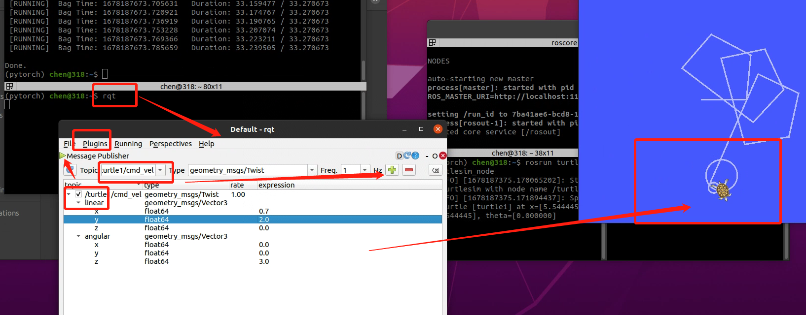

### （2）rqt-graph

可以直接在工具箱里调用


### （3）rqt-console

ros中用于显示和过滤日志的图形化插件

### （4）rqt-plot

以2D绘图的方式绘制数据

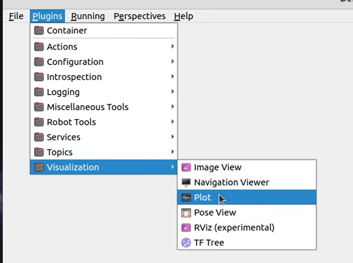

### （5）rqt-bag

录制和重放bag文件的图形化插件

rqt-bag启动或者在plugins选择，点击左上角红色圆圈开始选择需要录制的节点，并点击record添加bag文件存放的路径即可开始录制


 需要回放时点击圆圈旁边的文件夹按钮，选择想要回放的bag文件，回放时要注意需要右键点击进度条，勾选publisher乌龟才会运动。

# 九、机器人系统仿真

## 1、URDF集成rviz基本流程

（1）创建功能包，并添加依赖，与机器人模型相关的依赖主要有urdf 和xacro

（2）在功能包下新建一些文件夹

launch：用于存放launch启动文件

urdf：存放机器人描述文件（urdf文件）

meshes：用于给机器人贴皮肤

config：存放配置文件

（3）编写urdf文件，生成一个方形的机器人模型

```html
<robot name="mycar">
    <link name="base_link">
        <visual>
            <geometry>
                <box size="0.5 0.2 0.1" />
            </geometry>
        </visual>
    </link>
</robot>
```

（4）创建launch启动文件

```html
<launch>
	<!-- 1、在参数服务器载入urdf文件-->
	<param name="robot_description" textfile="
	$(find urdf_rviz)/urdf/urdf/helloworld.urdf"/>
	<!-- 2、启动rviz-->
	<node pkg="rviz" type="rviz" name="rviz"/>
</launch>
```

(5)配置rviz显示机器人模型，注意Fixed Frame要选择urdf里设置的名称link name，也可以添加TF坐标轴直观显示。

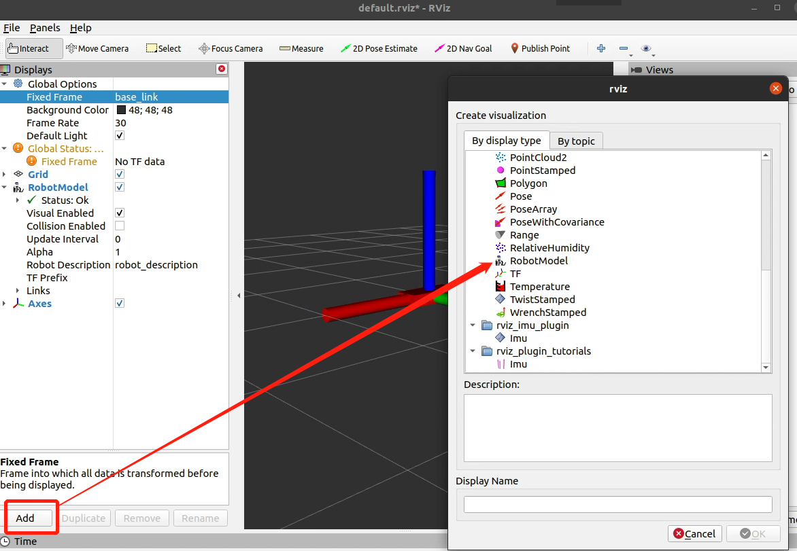

（6）保存配置

由于不保存配置时会导致当下次再次打开launch文件打开rviz时，仍然需要重新配置

左上角File，save config as，存放到文件夹config中即可

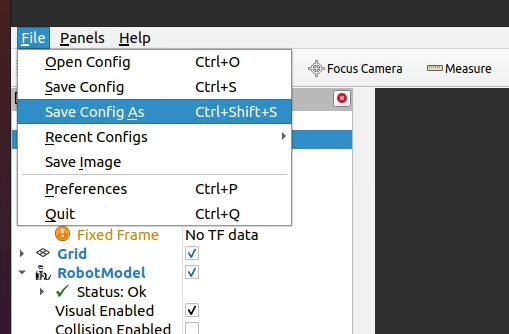

在launch文件中需要导入配置好的rviz文件


重新启动时就无需再重复配置了

## 2、URDF文件编写语法

urdf文件是标准xml文件，预定义了一些列标签用于描述机器人模型，主要分为两类连杆（link）与关节（joint）

- 连杆：机器人的可见部分，即刚体部分
- 关节：连杆之间饿关系连接（关节），但是关节这部分在直观上是不可见的
- robot：类似跟标签的存在
- gazebo：gazebo仿真时使用的标签，用于配置机器人的所需参数，如机器人的材料属性，gazebo插件等，但这类标签并不必须，只有在需要仿真时设置。

### （1）robot标签

​      urdf为了保证xml文件语法完整性，使用robot标签作为跟标签，所有的 link 和 joint 以及其他标签都必须包含在 robot 标签内,在该标签内可以通过 name 属性设置机器人模型的名称。

### （2）link标签

描述机器人某部件的外观和刚体属性，比如: 机器人底座、轮子、激光雷达、摄像头...每一个部件都对应一个 link, 在 link 标签内，可以设计该部件的形状、尺寸、颜色、惯性矩阵、碰撞参数等一系列属性

编写urdf文件时，关键在于要理清层级关系

1.属性
name ---> 为连杆命名
2.子标签
visual ---> 描述外观(对应的数据是可视的)

- geometry 设置连杆的几何形状


​		标签1: box(盒状)

​				属性:size=长(x) 宽(y) 高(z)
​		标签2: cylinder(圆柱)

​				属性:radius=半径 length=高度
​		标签3: sphere(球体)

​				属性:radius=半径
​		标签4: mesh(为连杆添加皮肤)

​				属性: filename=资源路径(格式:\package://<packagename>/<path>/文件)

示例如下：

```html
<!-- 设置不同形状的机器人部件 -->
<robot name="mycar">
    <link name="base_link">
        <!-- 可视化标签 -->
        <visual>
            <!-- 形状 -->
            <geometry>
                <!-- 立方体 -->
                <!-- <box size="0.3 0.2 0.1"/> -->
                <!-- 圆柱体-->
                <!-- <cylinder radius="0.2" length="1"/> -->
                <!--  球体-->
                <!-- <sphere radius="1"/> -->
                <!-- 添加皮肤 -->
                <mesh filename="package://urdf_rviz/meshes/autolabor_mini.stl"/>
            </geometry>
        </visual>
    </link>
</robot>
```

- ​	origin 设置偏移量与倾斜弧度

​			属性1: xyz=x偏移 y便宜 z偏移

​			属性2: rpy=x翻滚 y俯仰 z偏航 (单位是弧度)

示例如下：

```html
  <!-- 偏移量与倾斜弧度 -->
            <!-- xyz:设置分别在xyz上的偏移量
            rpy用于设置xyz三个方向的旋转角 -->
            <origin xyz='0 0 0' rpy='1.57 0 0'/>
```

- ​	metrial 设置材料属性(颜色)


​			属性: name

​			标签: color

​			属性: rgba=红绿蓝权重值与透明度 (每个权重值以及透明度取值[0,1])

示例如下：

```html
 <!-- 颜色 -->
            <!-- rgba:
            rgb三原色,a透明度,四个值取值都在0到1之间 -->
            <material name="car_color">
                <color rgba = "0.7 0.34 0.8 0.5"/>
            </material>
```

collision ---> 连杆的碰撞属性

Inertial ---> 连杆的惯性矩阵

### （3）joint标签

​      urdf 中的 joint 标签用于描述机器人关节的运动学和动力学属性，还可以指定关节运动的安全极限，机器人的两个部件(分别称之为 parent link 与 child link)以"关节"的形式相连接，不同的关节有不同的运动形式: 旋转、滑动、固定、旋转速度、旋转角度限制....,比如:安装在底座上的轮子可以360度旋转，而摄像头则可能是完全固定在底座上。joint标签对应的数据在模型中是不可见的。

1. **属性**

- name ---> 为关节命名
- type ---> 关节运动形式
  - continuous: 旋转关节，可以绕单轴无限旋转
  - revolute: 旋转关节，类似于 continues,但是有旋转角度限制
  - prismatic: 滑动关节，沿某一轴线移动的关节，有位置极限
  - planer: 平面关节，允许在平面正交方向上平移或旋转
  - floating: 浮动关节，允许进行平移、旋转运动
  - fixed: 固定关节，不允许运动的特殊关节

2. **子级标签**

- parent(必需的)

  parent link的名字是一个强制的属性：

  - link:父级连杆的名字，是这个link在机器人结构树中的名字。

- child(必需的)

  child link的名字是一个强制的属性：

  - link:子级连杆的名字，是这个link在机器人结构树中的名字。

- origin

  - 属性: xyz=各轴线上的偏移量 rpy=各轴线上的偏移弧度。

- axis

  - 属性: xyz用于设置围绕哪个关节轴运动。

```html
<!-- 需求:设置机器人底盘,并添加摄像头 -->
<robot name="mycar">
    <!-- 1 底盘link -->
    <link name="base_link">
        <!-- 可视化标签 -->
        <visual>
            <!-- 形状 -->
            <geometry>
                <!-- 立方体 -->
                <box size="0.3 0.2 0.1"/>
            </geometry>
            <!-- 偏移量与倾斜弧度 -->
            <!-- xyz:设置分别在xyz上的偏移量
            rpy用于设置xyz三个方向的旋转角 -->
            <origin xyz='0 0 0' rpy='0 0 0'/>

            <!-- 颜色 -->
            <!-- rgba:
            rgb三原色,a透明度,四个值取值都在0到1之间 -->
            <material name="car_color">
                <color rgba = "0.3 0.4 0.8 0.8"/>
            </material>
        </visual>
    </link>

    <!-- 2 摄像头link -->
    <link name="camera">
        <!-- 可视化标签 -->
        <visual>
            <!-- 形状 -->
            <geometry>
                <!-- 立方体 -->
                <box size="0.03 0.05 0.05"/>
            </geometry>
            <!-- 偏移量与倾斜弧度 -->
            <!-- xyz:设置分别在xyz上的偏移量
            rpy用于设置xyz三个方向的旋转角 -->
            <origin xyz='0 0 0.025' rpy='0 0 0'/>
            <!-- 需要上移半个摄像头的高度,才不会导致摄像头内嵌在机器人车体里 -->
            <!-- 颜色 -->
            <!-- rgba:
            rgb三原色,a透明度,四个值取值都在0到1之间 -->
            <material name="car_color">
                <color rgba = "0 1 0 0.8"/>
            </material>
        </visual>
    </link>
    <!-- 3 关节 -->
    <joint name="camera_to_link" type="continuous">
        <!-- 父级link -->
        <parent link="base_link"/>
        <!-- 子级link -->
        <child link="camera"/>
        <!-- 设置偏移量 -->
        <origin xyz='0.13 0 0.05' rpy='0 0 0'/>
        <!-- 设置关节旋转参考的坐标轴 -->
        <axis xyz='0 0 1'/>
    </joint>
</robot>
```

launch文件编写：

```html
<launch>
    <!-- 1、在参数服务器载入urdf文件 -->
    <param name="robot_description" textfile="$(find urdf_rviz)/urdf/urdf/joint.urdf"/>
    <!-- 2、启动rviz -->
    <node pkg="rviz" type="rviz" name="rviz" args="-d $(find urdf_rviz)/config/showmycar.rviz"/>
    <!-- 注意:只有上述两条语句时会抛出异常:显示位置与颜色异常,给出提示 no transform from camera to baselink(缺少坐标变换) -->
    <!-- 原因:rviz中显示urdf时.必须发布不同部件之间的坐标系关系 -->
    <!-- 解决:ROS中提供的关于机器人模型显示的坐标发布相关节点(joint_state_publisher 和 robot_state_publisher) -->
    <!-- 关节状态发布节点 -->
    <node pkg="joint_state_publisher" type="joint_state_publisher" name="joint_state_publisher"/>
    <!-- 机器人状态发布节点 -->
    <node pkg="robot_state_publisher" type="robot_state_publisher" 
name="robot_state_publisher"/>
    <!--添加控制机器人关节运动的节点-->
    <node pkg="joint_state_publisher_gui" type="joint_state_publisher_gui"
name="joint_state_publisher_gui"/>
</launch>
```

注意：关节控制节点不是必须的，它的作用在于提供一个控制关节节点运动的UI界面，便于调试urdf文件是否正常。

### （4）URDF工具

在 ROS 中，提供了一些工具来方便 URDF 文件的编写，比如:

- check_urdf命令可以检查复杂的 urdf 文件是否存在语法问题

- urdf_to_graphiz命令可以查看 urdf 模型结构，显示不同 link 的层级关系

使用工具之前，首先需要安装，安装命令:sudo apt install liburdfdom-tools

## 3、在RVIZ中控制机器人运动（Arbotix）

（1）安装arbotix

```
sudo apt-get ros-neotic-arbotix
```


## 4、URDF集成Gazebo的基本流程

（1）创建功能包

功能包：urdf_gazebo

依赖：urdf xacro gazebo_ros gazebo_ros_control gazebo_plugins

（2）文件夹准备

新建文件夹：urdf——新建文件

urdf文件写好之后，可以用check_urdf工具检查是否有语法错误，人工检查难以发现，可能会导致后续gazebo环境中无法正确显示。

检查命令：在终端进入urdf文件所在文件夹

```
check_urdf xxx.urdf(urdf文件名)
```

urdf代码示例：

```xml
<robot name="myrobot">
    <link name="base_link">
        <!-- 可视化部分 -->
        <visual>
            <geometry>
                <box size="0.5 0.3 0.1"/>
            </geometry>
            <origin xyz="0 0 0" rpy="0 0 0"/>
            <!-- 由于仿真中刚体不会透明,于是颜色在gazebo中不再生效,gazebo有特定的颜色设置 -->
            <material name="yellow">
                <color rgba="0.5 0.5 0 0.8"/>
            </material>
        </visual>
        <!-- gezebo与rviz不同的部分:collision碰撞属性和inertial惯性矩阵 -->
        <!-- 1.碰撞参数collision:如果是标准几何体,直接复制isual中的geometry和origin即可 -->
        <collision>
            <geometry>
                <box size="0.5 0.3 0.1"/>
            </geometry>
            <origin xyz="0 0 0" rpy="0 0 0"/>
        </collision>
        <!-- 2.惯性矩阵inertial:需要公式计算,与重心和质量有关 -->
        <inertial>
            <!-- 设置重心偏移:质量密度均匀时就是000 -->
            <origin xyz="0 0 0"/>
            <!-- 标签mass设置质量 -->
            <mass value="2"/>
            <!-- 不同维度上的惯性参数:需要通过公式计算,否则仿真可能会出问题 -->
            <inertia ixx="1" ixy="0" ixz="0" iyy="1" iyz="0" izz="1"/>
        </inertial>  
    </link>
    <!-- gazebo颜色设置(注意位置,设置在连杆标签外的) -->
    <gazebo reference="base_link">
        <material>Gazebo/Red</material>
    </gazebo>
</robot>
```

将urdf文件和gazebo启动集成到launch文件中

```xml
<launch>
    <!-- 在参数服务器中载入urdf -->
    <param name="robot_description" textfile="$(find urdf_gazebo)/urdf/helloworld.urdf"/>
    <!-- 启动gazebo仿真环境 -->
    <include file="$(find gazebo_ros)/launch/empty_world.launch"/>
    <!-- 在gazebo中添加机器人模型 -->    
    <node pkg="gazebo_ros" type="spawn_model" name="spawn_model" args="-urdf -model car -param robot_description"/>
    <!-- car是名字，可以自己取，别的不可以-->
</launch>
```

## 5、Gazebo导入自定义环境

​    之前的案例gazebo中导入的是一个空世界empty_world，这里会介绍如何导入房屋数目等自定义的环境

（1）启动 gazebo 打开构建面板，绘制仿真环境

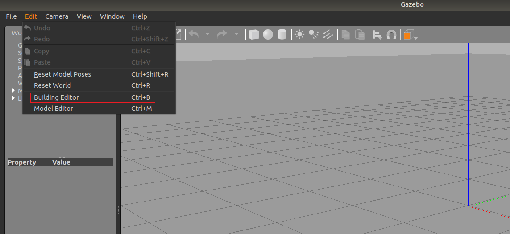

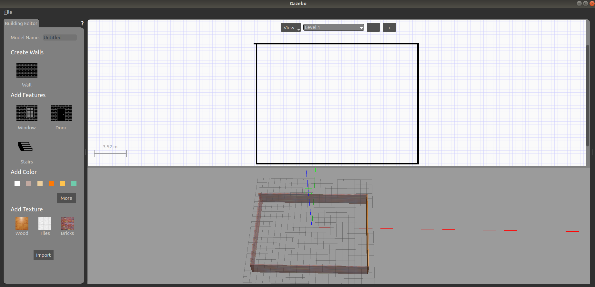

（2）保存构建的环境

点击: 左上角 file ---> Save (保存路径功能包下的: models)

然后 file ---> Exit Building Editor

（3） 保存为 world 文件
可以用页面上方gazebo自带的工具箱再添加一些插件，然后保存为 world 文件(保存路径功能包下的: worlds)，注意这里的文件夹命名必须是worlds


（4）启动自定义环境

```xml
<launch>

    <!-- 将 Urdf 文件的内容加载到参数服务器 -->
    <param name="robot_description" command="$(find xacro)/xacro $(find demo02_urdf_gazebo)/urdf/xacro/my_base_camera_laser.urdf.xacro" />
    <!-- 启动 gazebo -->
    <include file="$(find gazebo_ros)/launch/empty_world.launch">
        <arg name="world_name" value="$(find demo02_urdf_gazebo)/worlds/hello.world" />
    </include>

    <!-- 在 gazebo 中显示机器人模型 -->
    <node pkg="gazebo_ros" type="spawn_model" name="model" args="-urdf -model mycar -param robot_description"  />
</launch>
```

​           通过roslaunch启动相关的env.launch文件，这里的关键部分是在launch文件中用include标签集成启动gazebo部分，由原来的空世界（empty_world）变成了自定义的world文件worlds/hello.world

## 6、机器人运动控制ROS-control

​       需要编写一个单独的xacro文件，为机器人模型添加传动装置以及控制器，这里主要需要修改的是joint_name，需要和urdf/xacro编写时给驱动轮的名字相同。

```xml
<robot name="my_car_move" xmlns:xacro="http://wiki.ros.org/xacro">

    <!-- 传动实现:用于连接控制器与关节 -->
    <xacro:macro name="joint_trans" params="joint_name">
        <!-- Transmission is important to link the joints and the controller -->
        <transmission name="${joint_name}_trans">
            <type>transmission_interface/SimpleTransmission</type>
            <joint name="${joint_name}">
                <hardwareInterface>hardware_interface/VelocityJointInterface</hardwareInterface>
            </joint>
            <actuator name="${joint_name}_motor">
                <hardwareInterface>hardware_interface/VelocityJointInterface</hardwareInterface>
                <mechanicalReduction>1</mechanicalReduction>
            </actuator>
        </transmission>
    </xacro:macro>

    <!-- 每一个驱动轮都需要配置传动装置 -->
    <xacro:joint_trans joint_name="left_wheel2base_link" />
    <xacro:joint_trans joint_name="right_wheel2base_link" />

    <!-- 控制器 -->
    <gazebo>
        <plugin name="differential_drive_controller" filename="libgazebo_ros_diff_drive.so">
            <rosDebugLevel>Debug</rosDebugLevel>
            <publishWheelTF>true</publishWheelTF>
            <robotNamespace>/</robotNamespace>
            <publishTf>1</publishTf>
            <publishWheelJointState>true</publishWheelJointState>
            <alwaysOn>true</alwaysOn>
            <updateRate>100.0</updateRate>
            <legacyMode>true</legacyMode>
            <leftJoint>left_wheel2base_link</leftJoint> <!-- 左轮 -->
            <rightJoint>right_wheel2base_link</rightJoint> <!-- 右轮 -->
            <wheelSeparation>${base_link_radius * 2}</wheelSeparation> <!-- 车轮间距 -->
            <wheelDiameter>${wheel_radius * 2}</wheelDiameter> <!-- 车轮直径 -->
            <broadcastTF>1</broadcastTF>
            <wheelTorque>30</wheelTorque>
            <wheelAcceleration>1.8</wheelAcceleration>
            <commandTopic>cmd_vel</commandTopic> <!-- 运动控制话题 -->
            <odometryFrame>odom</odometryFrame> 
            <odometryTopic>odom</odometryTopic> <!-- 里程计话题 -->
            <robotBaseFrame>base_footprint</robotBaseFrame> <!-- 根坐标系 -->
        </plugin>
    </gazebo>
</robot>

```

​       用\<xacro:include/>标签，将该xacro文件集成到整体的car.urdf.xacro文件中，这里要注意文件存放位置。

​       运行launch文件，启动gazebo仿真环境，通过命令rostopic list，查看目前已有话题名称，可以看到cmd_vel，运动控制节点话题。

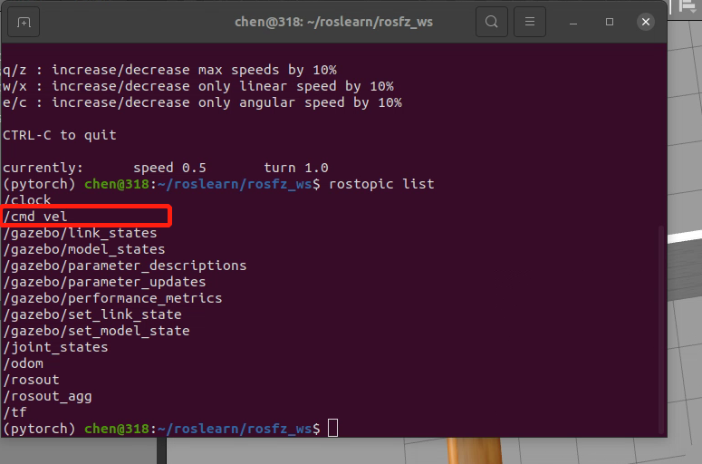

通过键盘控制节点可以实现键盘控制小车运动

```
rosrun teleop_twist_keyboard teleop_twist_keyboard.py
```

## 7、综合运动控制：rviz里程计查看

在机器人运动控制的xacro文件中，控制器部分导入了里程计话题

```xml
<odometryTopic>odom</odometryTopic> <!-- 里程计话题 -->
```

我们可以在rviz中可视化查看里程计的效果

（1）通过launch文件打开rviz

```xml
<launch>
    <!-- 启动 rviz -->
    <node pkg="rviz" type="rviz" name="rviz" />

    <!-- 关节以及机器人状态发布节点 -->
    <node name="joint_state_publisher" pkg="joint_state_publisher" type="joint_state_publisher" />
    <node name="robot_state_publisher" pkg="robot_state_publisher" type="robot_state_publisher" />

</launch>
```

（2）添加odometry组件，查看里程计消息

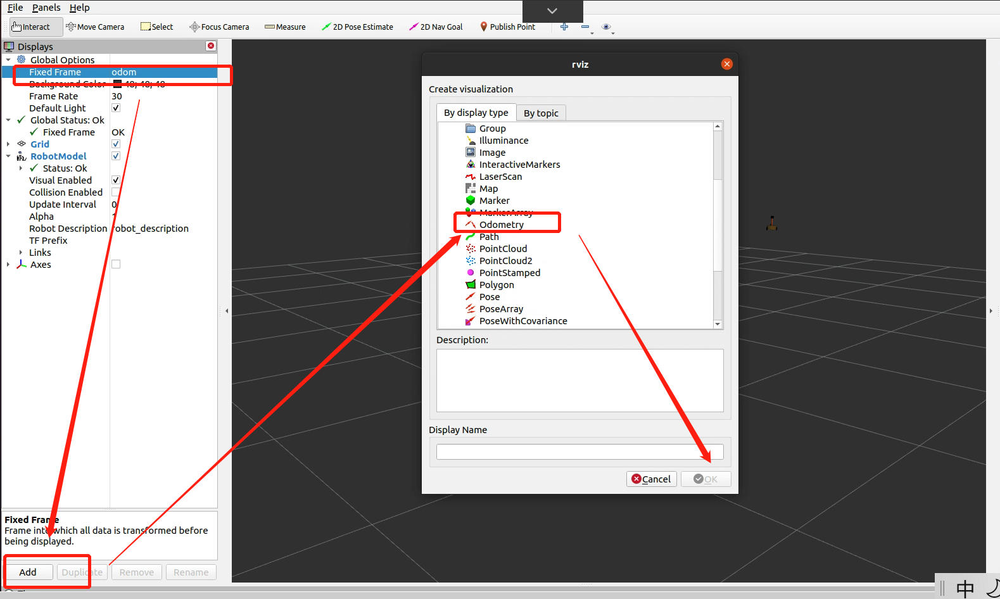

（3）添加/odom话题，查看里程计显示

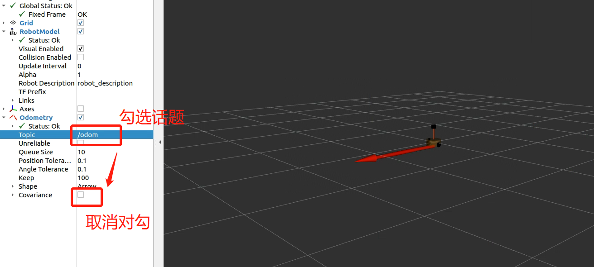

（4）启动键盘控制话题，控制小车运动，即可实时看到里程计的显示情况

```
rosrun teleop_twist_keyboard teleop_twist_keyboard.py
```

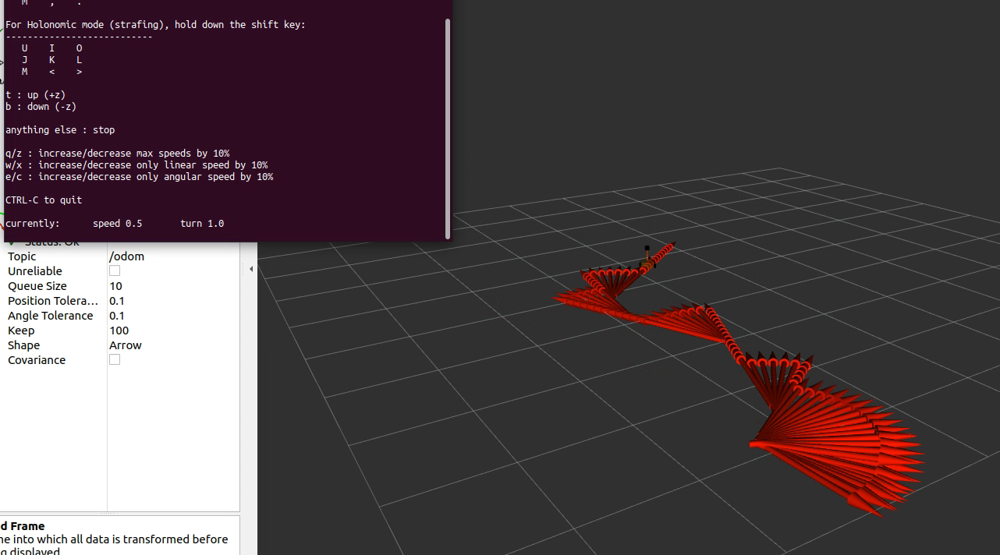

## 8、综合运动控制：雷达信息仿真及显示

（1）新建laser.xacro文件并集成到小车模型文件中（include）

​          编写laser.xacro文件，需要修改对照的部分是：

​          第三行gazebo reference部分和倒数第五行frame name的名字“laser”，该文件要作用到机器人模型的雷达连杆部分，要找到自己雷达连杆设置的名字并对应修改。该标签上面的topicname话题就是雷达传感器发布数据所用的话题，这里是/scan。

```xml
<robot name="my_sensors" xmlns:xacro="http://wiki.ros.org/xacro">
  <!-- 雷达 -->
  <gazebo reference="laser">
    <sensor type="ray" name="rplidar">雷达类型
      <pose>0 0 0 0 0 0</pose>雷达位姿
      <visualize>true</visualize>gazebo是否显示雷达射线
      <update_rate>5.5</update_rate>雷达射线的更新频率
      <ray>
        <scan>
          <horizontal>
            <samples>360</samples>采样个数：雷达旋转一周采样几个点
            <resolution>1</resolution>分辨率：可以设置为整数n，每n个射线测距一次
            <min_angle>-3</min_angle>设置雷达的采样范围（180度采样？120度采样？单位是弧度制）
            <max_angle>3</max_angle>
          </horizontal>
        </scan>
        <range>
          <min>0.10</min>雷达有效范围0.1米到30米
          <max>30.0</max>
          <resolution>0.01</resolution>测量距离的精确度，单位米
        </range>
        <noise>高斯噪音：用于仿真，模拟实际过程中产生的误差
          <type>gaussian</type>
          <mean>0.0</mean>
          <stddev>0.01</stddev>
        </noise>
      </ray>
      <plugin name="gazebo_rplidar" filename="libgazebo_ros_laser.so">
        <topicName>/scan</topicName>雷达发布消息的话题名
        <frameName>laser</frameName>雷达坐标系名
      </plugin>
    </sensor>
  </gazebo>
</robot>
```

（2）roslaunch启动env.launch和rviz

观察gazebo的结果，可以看到仿真中会显示雷达信号的波束

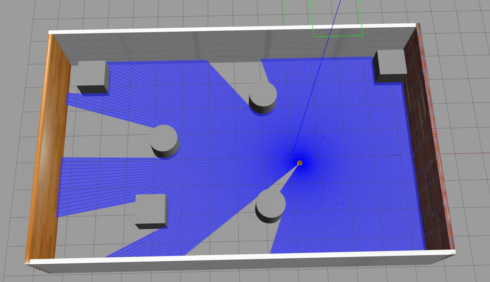

（3）在RVIZ中进行对应设置，显示雷达信号的组件

改坐标系Fixed Frames：odom，添加组件laserscan


​       topic选择/scan，可以看到rviz中出现了一些红色的点组成的边界，这就是雷达信息得到的信号，可以看到周围环境的障碍物情况

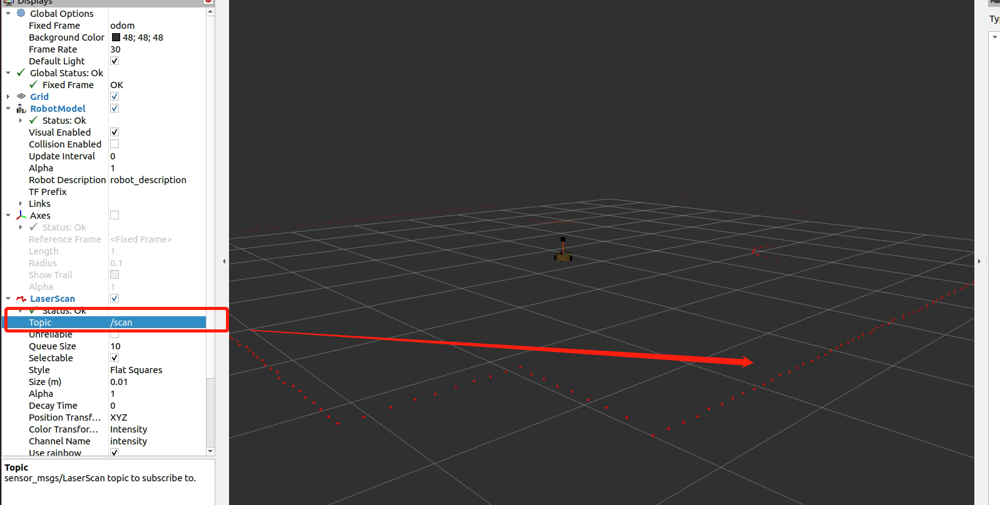

## 9、综合运动控制：摄像头信息仿真及显示

（1）新建camera.xacro文件并集成到机器人模型的xacro文件中（include）

编写camera.xacro文件,主要需要修改的地方有（类似雷达仿真）：

gazebo reference：将该文件作用到小车文件的哪个连杆上，要与摄像头的link name保持一致

frame name：摄像头坐标系名称，同上，与摄像头link name一致

```xml
<robot name="my_sensors" xmlns:xacro="http://wiki.ros.org/xacro">
  <!-- 被引用的link -->
  <gazebo reference="camera">
    <!-- 类型设置为 camara -->
    <sensor type="camera" name="camera_node">
      <update_rate>30.0</update_rate> <!-- 更新频率 -->
      <!-- 摄像头基本信息设置 -->
      <camera name="head">
        <horizontal_fov>1.3962634</horizontal_fov>
        <image>
          <width>1280</width>
          <height>720</height>
          <format>R8G8B8</format>
        </image>
        <clip>
          <near>0.02</near>
          <far>300</far>
        </clip>
        <noise>
          <type>gaussian</type>
          <mean>0.0</mean>
          <stddev>0.007</stddev>
        </noise>
      </camera>
      <!-- 核心插件 -->
      <plugin name="gazebo_camera" filename="libgazebo_ros_camera.so">
        <alwaysOn>true</alwaysOn>
        <updateRate>0.0</updateRate>
        <cameraName>/camera</cameraName>
        <imageTopicName>image_raw</imageTopicName>
        <cameraInfoTopicName>camera_info</cameraInfoTopicName>
        <frameName>camera</frameName>
        <hackBaseline>0.07</hackBaseline>
        <distortionK1>0.0</distortionK1>
        <distortionK2>0.0</distortionK2>
        <distortionK3>0.0</distortionK3>
        <distortionT1>0.0</distortionT1>
        <distortionT2>0.0</distortionT2>
      </plugin>
    </sensor>
  </gazebo>
</robot>
```

（2）通过roslaunch命令打开gazebo环境和rivz

gazebo和雷达仿真结果没有区别，现在rviz中添加插件查看摄像头的情况

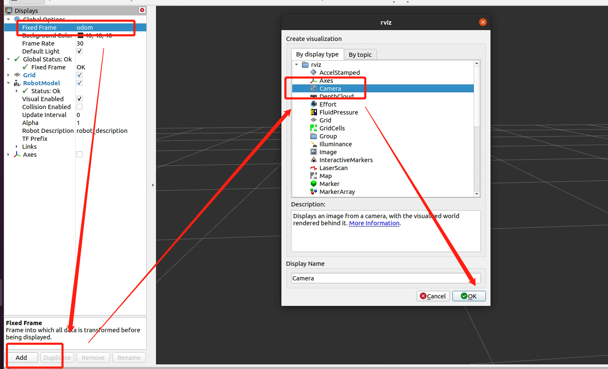


小车运动时，也可以看到下面摄像头的画面会随之运动

可以通过话题发布命令查看运动是的摄像头画面变化，cmd_vel话题，这里可以tab键自动补齐

```
rostopic pub -r 10 /cmd_vel geometry_msgs/Twist"linear:
x:1.0
y:2.0
z:0
angular:
x:0
y:0
z:0.5"
```

## 10、综合运动控制：kinect深度相机仿真

kinect：感知障碍物图像和距离信息

（1）新建文件kinect.xacro并通过include标签集成到car小车模型文件中

```xml
<xacro:include filename="my_sensors_kinect.urdf.xacro" />
```

（2）编写xacro文件

需要修改的地方主要还是gazebo reference和frame name，修改为作用到哪个连杆的名字

```xml
<robot name="my_sensors" xmlns:xacro="http://wiki.ros.org/xacro">
    <gazebo reference="kinect link名称">  
      <sensor type="depth" name="camera">
        <always_on>true</always_on>
        <update_rate>20.0</update_rate>
        <camera>
          <horizontal_fov>${60.0*PI/180.0}</horizontal_fov>
          <image>
            <format>R8G8B8</format>
            <width>640</width>
            <height>480</height>
          </image>
          <clip>
            <near>0.05</near>
            <far>8.0</far>
          </clip>
        </camera>
        <plugin name="kinect_camera_controller" filename="libgazebo_ros_openni_kinect.so">
          <cameraName>camera</cameraName>话题命名空间
          <alwaysOn>true</alwaysOn>
          <updateRate>10</updateRate>
          <imageTopicName>rgb/image_raw</imageTopicName>图像信息采集话题
          <depthImageTopicName>depth/image_raw</depthImageTopicName>深度信息采集话题
          <pointCloudTopicName>depth/points</pointCloudTopicName>
          <cameraInfoTopicName>rgb/camera_info</cameraInfoTopicName>
          <depthImageCameraInfoTopicName>depth/camera_info</depthImageCameraInfoTopicName>
          <frameName>kinect link名称</frameName>
          <baseline>0.1</baseline>
          <distortion_k1>0.0</distortion_k1>
          <distortion_k2>0.0</distortion_k2>
          <distortion_k3>0.0</distortion_k3>
          <distortion_t1>0.0</distortion_t1>
          <distortion_t2>0.0</distortion_t2>
          <pointCloudCutoff>0.4</pointCloudCutoff>
        </plugin>
      </sensor>
    </gazebo>
</robot>
```

（3）roslaunch启动env.launch（gazebo环境）和sensor.launch（rviz环境）即可看到效果

​        gazebo中的环境会显示出已经配置过的雷达信号，深度相机信息主要通过rviz查看，和添加普通的camera方法一样，在rviz中添加camera组件


​       与添加查看普通相机不同的是，此时我们的话题里既有普通相机的话题，也有深度相机的话题，我们在这里选择depth相关话题即可查看深度相机的相关信息。

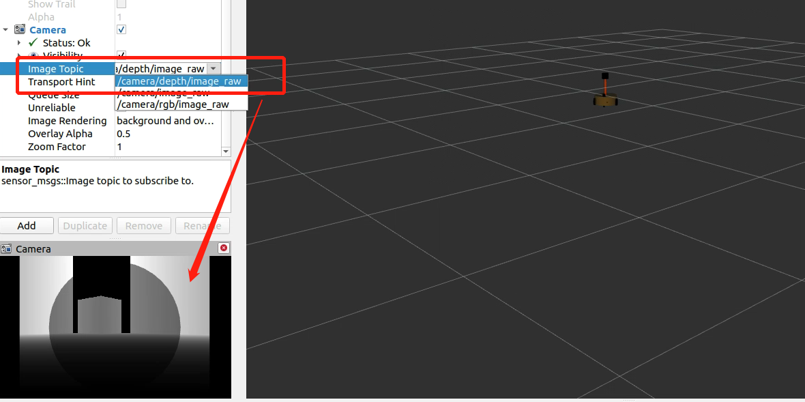

（4）kinect点云信息显示，在rviz中添加组件pointcloud2并设置topic话题camera/depth/points

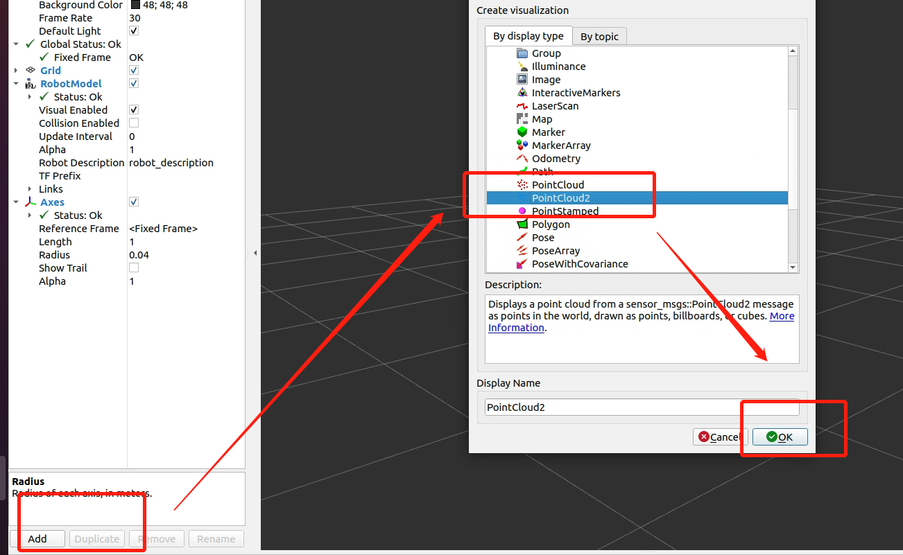

​        这时会发现在rviz中点云图像信息显示时错位，这是因为在kinect中图像数据与点云数据使用了两套坐标系统，且两套坐标系统位姿并不一致。


解决方案：

本来点云使用的是连杆的坐标系，需要修改一下，这里命名为support_depth

```xml
<frameName>support_depth</frameName>
```

​       由于该坐标系在机器人模型配置文件中并不存在，所以需要在启动rviz的launch文件中手动配置静态坐标变换信息.

**注意：**这里的args参数分别是xyz位置偏移量，zyx角度偏移量和父级坐标系子级坐标系。

```xml
<!--添加support到连杆的坐标变换-->
<node pkg="tf2_ros" type="static_transform_publisher" name="static_transform_publisher" args="0 0 0 -1.57 0 -1.57 /support /support_depth"
```


# 十、机器人导航仿真

## 1、导航定位方式：

（1）通过里程计定位:时时收集机器人的速度信息计算并发布机器人坐标系与父级参考系的相对关系。

- 优点:里程计定位信息是连续的，没有离散的跳跃。
- 缺点:里程计存在累计误差，不利于长距离或长期定位。

（2）通过传感器定位:通过传感器收集外界环境信息通过匹配计算并发布机器人坐标系与父级参考系的相对关系。

- 优点:比里程计定位更精准；
- 缺点:传感器定位会出现跳变的情况，且传感器定位在标志物较少的环境下，其定位精度会大打折扣。

两种定位方式优缺点互补，应用时一般二者结合使用。

（3）结合使用时的坐标变换关系

​        两种定位实现中，机器人坐标系一般使用机器人模型中的根坐标系(base_link 或 base_footprint)，里程计定位时，父级坐标系一般称之为 odom，如果通过传感器定位，父级参考系一般称之为 map。当二者结合使用时，map 和 odom 都是机器人模型根坐标系的父级，这是不符合坐标变换中"单继承"的原则的，所以，一般会将转换关系设置为: map -> doom -> base_link 或 base_footprint。

## 2、导航实现：SLAM建图

先安装相关的ROS功能包:

- 安装 gmapping 包(用于构建地图):sudo apt install ros-<ROS版本>-gmapping


- 安装地图服务包(用于保存与读取地图):sudo apt install ros-<ROS版本>-map-server


- 安装 navigation 包(用于定位以及路径规划):sudo apt install ros-<ROS版本>-navigation


新建功能包，并导入依赖: gmapping map_server amcl move_base，其中gampping用于构建地图，map_server用于保存与读取地图，amcl用于定位，move_base用于路径规划

（1）编写gmapping相关的launch文件

复制并修改如下:

```xml
<launch>
<param name="use_sim_time" value="true"/>是否使用仿真时间（仿真时要设置为True）
    <node pkg="gmapping" type="slam_gmapping" name="slam_gmapping" output="screen">
      <remap from="scan" to="scan"/>设置雷达话题，前面仿真雷达设置的话题就是scan
      <param name="base_frame" value="base_footprint"/><!--底盘坐标系-->
      <param name="odom_frame" value="odom"/> <!--里程计坐标系-->
      <param name="map_update_interval" value="5.0"/>地图更新频率间隔
      <param name="maxUrange" value="16.0"/>雷达测试范围最大16m
      <param name="sigma" value="0.05"/>
      <param name="kernelSize" value="1"/>
      <param name="lstep" value="0.05"/>
      <param name="astep" value="0.05"/>
      <param name="iterations" value="5"/>
      <param name="lsigma" value="0.075"/>
      <param name="ogain" value="3.0"/>
      <param name="lskip" value="0"/>
      <param name="srr" value="0.1"/>
      <param name="srt" value="0.2"/>
      <param name="str" value="0.1"/>
      <param name="stt" value="0.2"/>
      <param name="linearUpdate" value="1.0"/>
      <param name="angularUpdate" value="0.5"/>
      <param name="temporalUpdate" value="3.0"/>
      <param name="resampleThreshold" value="0.5"/>
      <param name="particles" value="30"/>
      <param name="xmin" value="-50.0"/>
      <param name="ymin" value="-50.0"/>
      <param name="xmax" value="50.0"/>
      <param name="ymax" value="50.0"/>
      <param name="delta" value="0.05"/>
      <param name="llsamplerange" value="0.01"/>
      <param name="llsamplestep" value="0.01"/>
      <param name="lasamplerange" value="0.005"/>
      <param name="lasamplestep" value="0.005"/>
    </node>

    <node pkg="joint_state_publisher" name="joint_state_publisher" type="joint_state_publisher" />
    <node pkg="robot_state_publisher" name="robot_state_publisher" type="robot_state_publisher" />

    <node pkg="rviz" type="rviz" name="rviz" />
    <!-- 可以保存 rviz 配置并后期直接使用-->
    <!--
    <node pkg="rviz" type="rviz" name="rviz" args="-d $(find my_nav_sum)/rviz/gmapping.rviz"/>
    -->
</launch>
```

（2）启动Gazebo仿真环境和编写好的slam.launch文件

（3）在RVIZ中添加组件

- 添加机器人模型RobotModel

- 添加Laserscan并设置Topic话题scan

- 添加坐标系组件TF，Fram下即可找到map，odom

- 添加map组件用于建图，设置topic，发布话题栅格地图数据，这里设置为map

  即可看到如下效果：

  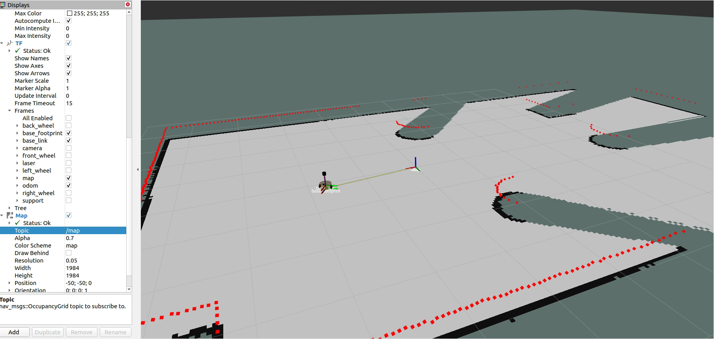

（4）在rviz中配置好之后，可以将目前配置保存：左上角save config as，保存到该功能包的config文件夹下，并在rivz启动中添加参数，以后启动就可以自动配置。

```xml
<node pkg="rviz" type="rviz" name="rviz" args="-d $find(功能包名) 功能包内的相对路径"/>
```

（5）启动键盘控制节点

```shell
rosrun teleop_twist_keyboard teleop_twist_keyboard.py
```

控制小车运动，绕着地图走一圈建图。

建图结果如图所示，白色部分是无障碍物可以走的地方，黑色圈出部位为障碍物信息


（6）保存地图（map_server包里的map_save）

如果直接关闭rviz退出，那么建好的地图将会消失，所以要编写launch文件进行保存操作

```xml
<launch>
    <arg name="filename" value="$(find mycar_nav)/map/nav" />
    <node name="map_save" pkg="map_server" type="map_saver" args="-f $(arg filename)" />
</launch>
```

可以看到在指定路径下产生了两个文件map_save.pgm和map_save.yaml

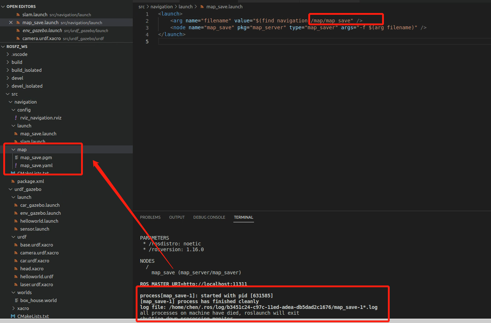

（7）读取地图信息（map_server包里的map_server）

新建launch文件，使用map_server调用上一步保存的map_save.yaml文件

代码示例如下

```xml
<launch>
	<node pkg="map_server" type="map_server" name="map_server" args="$(find 功能包名)/功能包内到yaml文件的路径"/>
</launch>
```

​        这样，我们之前发布的信息就会以话题的形式发布了，要看到地图的可视化效果我们需要借助rviz，可以在终端打开rviz并加入map插件，选择topic为map，即可看到效果。


## 3、导航实现：amcl定位

（1）首先编写启动amcl的launch文件，这里建议复制粘贴模板，再修改相关的参数即可，步骤如下：

- ~主目录下进入amcl文件:roscd amcl
- ls查看文件组成，ls examples进入查看examples示例文件
- example中提供了两种示例文件，amcl_diff是差速机器人，amcl_omni是全向机器人
- 通过文本编辑器gedit进入对应的launch文件，这里我们选择amcl_diff文件
- gedit example/amcl_diff.launch
- 复制到我们自己新建的launch文件中即可

（2）修改launch文件

示例中已经设置了odom坐标系，此外还需添加机器人坐标系和地图坐标系，这里设置机器人基坐标系为base_footprint，地图坐标系可以选择暂不设置，使用默认的globalmap

```xml
<launch>
<node pkg="amcl" type="amcl" name="amcl" output="screen">
  <!-- Publish scans from best pose at a max of 10 Hz -->
  <param name="odom_model_type" value="diff"/><!-- 里程计模式为差分 -->
  <param name="odom_alpha5" value="0.1"/>
  <param name="transform_tolerance" value="0.2" />
  <param name="gui_publish_rate" value="10.0"/>
  <param name="laser_max_beams" value="30"/>
  <param name="min_particles" value="500"/>
  <param name="max_particles" value="5000"/>
  <param name="kld_err" value="0.05"/>
  <param name="kld_z" value="0.99"/>
  <param name="odom_alpha1" value="0.2"/>
  <param name="odom_alpha2" value="0.2"/>
  <!-- translation std dev, m -->
  <param name="odom_alpha3" value="0.8"/>
  <param name="odom_alpha4" value="0.2"/>
  <param name="laser_z_hit" value="0.5"/>
  <param name="laser_z_short" value="0.05"/>
  <param name="laser_z_max" value="0.05"/>
  <param name="laser_z_rand" value="0.5"/>
  <param name="laser_sigma_hit" value="0.2"/>
  <param name="laser_lambda_short" value="0.1"/>
  <param name="laser_lambda_short" value="0.1"/>
  <param name="laser_model_type" value="likelihood_field"/>
  <!-- <param name="laser_model_type" value="beam"/> -->
  <param name="laser_likelihood_max_dist" value="2.0"/>
  <param name="update_min_d" value="0.2"/>
  <param name="update_min_a" value="0.5"/>

  <param name="odom_frame_id" value="odom"/><!-- 里程计坐标系 -->
  <param name="base_frame_id" value="base_footprint"/><!-- 添加机器人基坐标系 -->
  <param name="global_frame_id" value="map"/><!-- 添加地图坐标系 -->

  <param name="resample_interval" value="1"/>
  <param name="transform_tolerance" value="0.1"/>
  <param name="recovery_alpha_slow" value="0.0"/>
  <param name="recovery_alpha_fast" value="0.0"/>
</node>
</launch>
```

（3）编写测试文件

包括启动rviz，启动地图服务，启动amcl定位

（4）启动gazebo仿真环境、启动amcl.launch文件、启动键盘控制小车运动节点（teleop_twist_keyboard），这样，gazebo环境、rviz环境都正常打开并可以控制小车运动。

（5）接下来在RVIZ中添加组件

- RobotModel显示机器人模型

- map组件显示地图

- posearray显示定位结果

  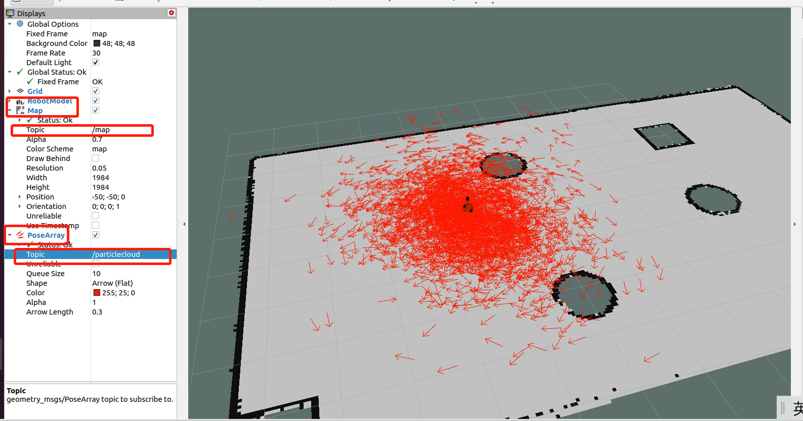

（6）观察结果

启用键盘控制，在rviz中即可看到位置动态变化估计

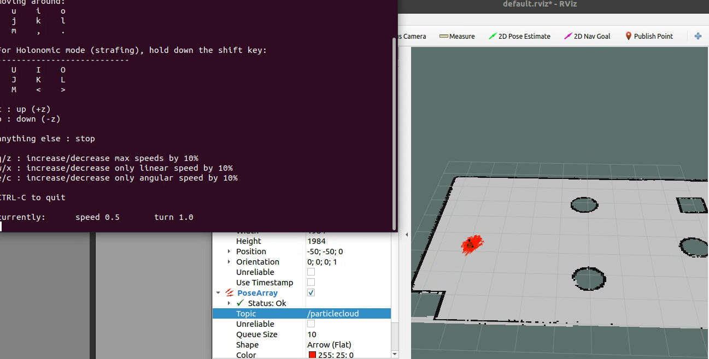

## 4、导航实现之路径规划

​        move_base 功能包提供了基于动作(action)的路径规划实现，move_base 可以根据给定的目标点，控制机器人底盘运动至目标位置，并且在运动过程中会连续反馈机器人自身的姿态与目标点的状态信息，move_base主要由全局路径规划与本地路径规划组成。

​        move_base已经被集成到了navigation包，可以通过如下命令安装：

```shell
sudo apt install ros-<ROS版本>-navigation
```

（1）构建适用于机器人导航的代价地图

​       由于导航过程中，障碍物信息是可变的，导航时机器人需要实时获取当前的障碍物信息，且机器人在靠近障碍物边缘时，可能会由于惯性、机器人体的不规则外形，在转弯等过程中发生碰撞，SLAM构建的静态地图在导航中是不可以直接使用的，需要构建实时获取数据和障碍物膨胀后的代价地图。

代价地图：

- 全局代价地图（全局路径规划）

- 本地代价地图（本地路径规划）

（2）使用move_base功能包编写路径规划相关得launch文件

复制调用模板，将功能包修改为自己功能包得名字

```xml
<launch>

    <node pkg="move_base" type="move_base" respawn="false" name="move_base" output="screen" clear_params="true">
        <rosparam file="$(find 功能包)/param/costmap_common_params.yaml" command="load" ns="global_costmap" />
        <rosparam file="$(find 功能包)/param/costmap_common_params.yaml" command="load" ns="local_costmap" />
        <rosparam file="$(find 功能包)/param/local_costmap_params.yaml" command="load" />
        <rosparam file="$(find 功能包)/param/global_costmap_params.yaml" command="load" />
        <rosparam file="$(find 功能包)/param/base_local_planner_params.yaml" command="load" />
    </node>

</launch>
```

（3）设置配置文件

在功能包里新建文件夹命名为param，将上文中得launch文件里涉及的配置文件名新建到这个文件夹中

粘贴标准例程中的代码，把各种坐标系名称和机器人几何参数修改到与自己的项目匹配。

- ###### costmap_common_params.yaml

该文件是move_base 在全局路径规划与本地路径规划时调用的通用参数，包括:机器人的尺寸、距离障碍物的安全距离、传感器信息等。配置参考如下:

```yaml
#机器人几何参，如果机器人是圆形，设置 robot_radius,如果是其他形状设置 footprint
robot_radius: 0.12 #圆形
# footprint: [[-0.12, -0.12], [-0.12, 0.12], [0.12, 0.12], [0.12, -0.12]] #其他形状

obstacle_range: 3.0 # 用于障碍物探测，比如: 值为 3.0，意味着检测到距离小于 3 米的障碍物时，就会引入代价地图
raytrace_range: 3.5 # 用于清除障碍物，比如：值为 3.5，意味着清除代价地图中 3.5 米以外的障碍物


#膨胀半径，扩展在碰撞区域以外的代价区域，使得机器人规划路径避开障碍物
inflation_radius: 0.2
#代价比例系数，越大则代价值越小
cost_scaling_factor: 3.0

#地图类型
map_type: costmap
#导航包所需要的传感器
observation_sources: scan
#对传感器的坐标系和数据进行配置。这个也会用于代价地图添加和清除障碍物。例如，你可以用激光雷达传感器用于在代价地图添加障碍物，再添加kinect用于导航和清除障碍物。
scan: {sensor_frame: laser, data_type: LaserScan, topic: scan, marking: true, clearing: true}
Copy
```

###### 

- ###### global_costmap_params.yaml

该文件用于全局代价地图参数设置:

```yaml
global_costmap:
  global_frame: map #地图坐标系
  robot_base_frame: base_footprint #机器人坐标系
  # 以此实现坐标变换

  update_frequency: 1.0 #代价地图更新频率
  publish_frequency: 1.0 #代价地图的发布频率
  transform_tolerance: 0.5 #等待坐标变换发布信息的超时时间

  static_map: true # 是否使用一个地图或者地图服务器来初始化全局代价地图，如果不使用静态地图，这个参数为false.
Copy
```

- ###### local_costmap_params.yaml

该文件用于局部代价地图参数设置:

```yaml
local_costmap:
  global_frame: odom #里程计坐标系
  robot_base_frame: base_footprint #机器人坐标系

  update_frequency: 10.0 #代价地图更新频率
  publish_frequency: 10.0 #代价地图的发布频率
  transform_tolerance: 0.5 #等待坐标变换发布信息的超时时间

  static_map: false  #不需要静态地图，可以提升导航效果
  rolling_window: true #是否使用动态窗口，默认为false，在静态的全局地图中，地图不会变化
  width: 3 # 局部地图宽度 单位是 m
  height: 3 # 局部地图高度 单位是 m
  resolution: 0.05 # 局部地图分辨率 单位是 m，一般与静态地图分辨率保持一致
Copy
```

- ###### base_local_planner_params

基本的局部规划器参数配置，这个配置文件设定了机器人的最大和最小速度限制值，也设定了加速度的阈值。

```yaml
TrajectoryPlannerROS:

# Robot Configuration Parameters
  max_vel_x: 0.5 # X 方向最大速度
  min_vel_x: 0.1 # X 方向最小速速

  max_vel_theta:  1.0 # 
  min_vel_theta: -1.0
  min_in_place_vel_theta: 1.0

  acc_lim_x: 1.0 # X 加速限制
  acc_lim_y: 0.0 # Y 加速限制
  acc_lim_theta: 0.6 # 角速度加速限制

# Goal Tolerance Parameters，目标公差
  xy_goal_tolerance: 0.10
  yaw_goal_tolerance: 0.05

# Differential-drive robot configuration
# 是否是全向移动机器人
  holonomic_robot: false

# Forward Simulation Parameters，前进模拟参数
  sim_time: 0.8
  vx_samples: 18
  vtheta_samples: 20
  sim_granularity: 0.05
```

（4）新建launch文件，将需要的map_server服务、amcl服务、rviz启动集成

```xml
<launch>
    <!-- 设置地图的配置文件 -->
    <arg name="map" default="nav.yaml" />
    <!-- 运行地图服务器，并且加载设置的地图-->
    <node name="map_server" pkg="map_server" type="map_server" args="$(find navigation)/map/$(arg map)"/>
    <!-- 启动AMCL节点 -->
    <include file="$(find navigation)/launch/amcl.launch" />

    <!-- 运行move_base节点 -->
    <include file="$(find navigation)/launch/path.launch" />
    <!-- 运行rviz -->
    <node pkg="rviz" type="rviz" name="rviz" args="-d $(find navigation)/rviz/navigation_test.rviz" />

</launch>
```

（5）启动gazebo仿真环境，运行集成后的launch文件，即可实现导航

（6）测试，可以看到gazebo和rviz都启动了，添加rviz组件：RobotModel、Map、Posearray、odometry


通过菜单栏上方的2D Nav Goal设置目标点，会发现小车会自行朝目标点运动

​        此外，我们还可以通过继续选择map的不同话题，得到全局和局部的代价地图（如下图所示），也可以选择添加Path，看到全局路径规划和局部路径规划的可视化结果

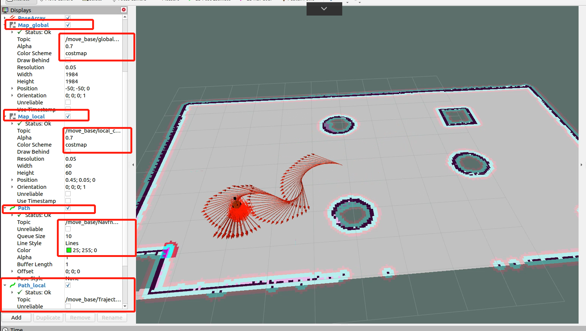

​        如果机器人出现走的不稳的情况，摇摇晃晃的，那么可以去配置文件中的base_local_planner_param中设置前进模拟参数，将sim_time调的稍微大些
